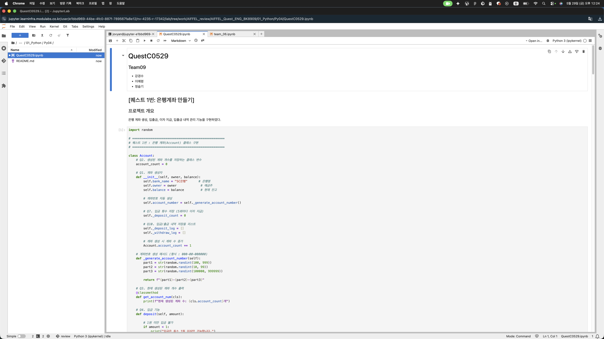
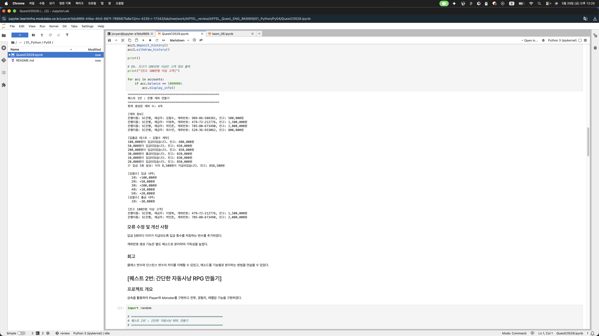
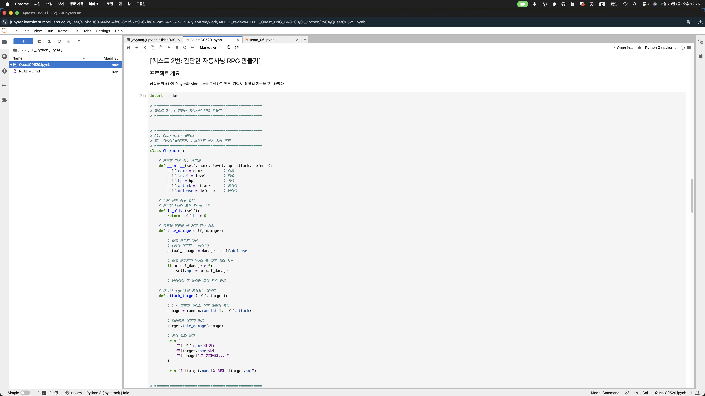
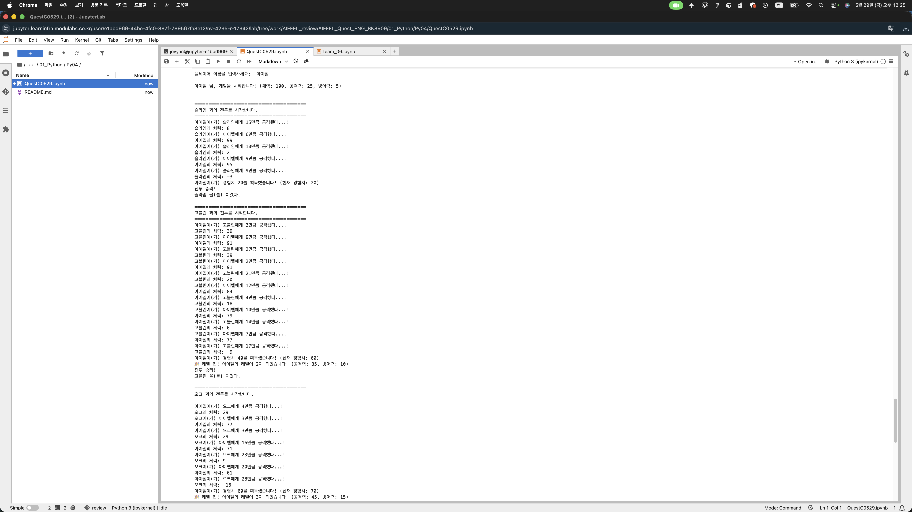
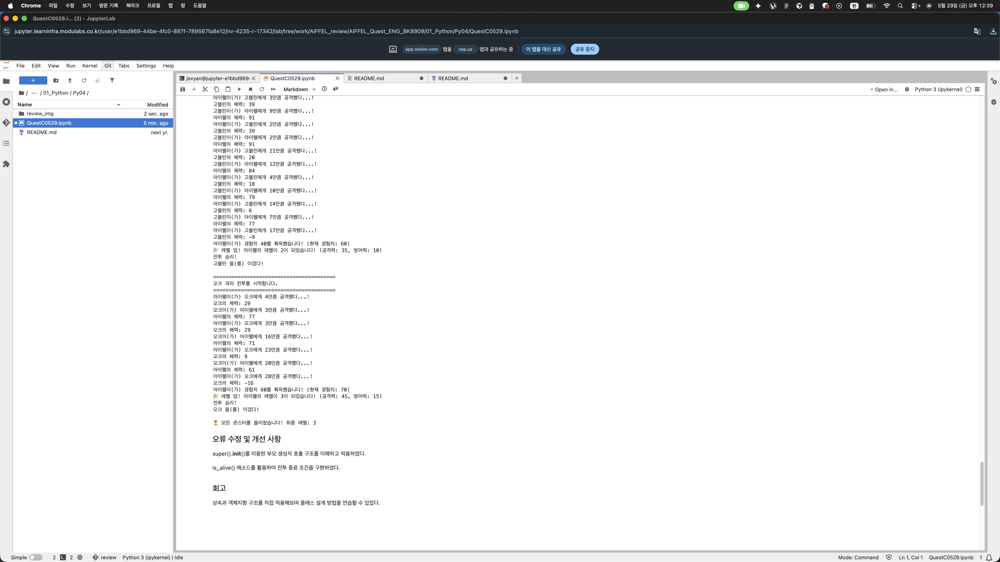

# AIFFEL Campus Online Code Peer Review Templete
- 코더 : 강경수
- 리뷰어 : 최승현


# PRT(Peer Review Template)
- [x]  **1. 주어진 문제를 해결하는 완성된 코드가 제출되었나요?**
    - 문제에서 요구하는 최종 결과물이 첨부되었는지 확인
        - 중요! 해당 조건을 만족하는 부분을 캡쳐해 근거로 첨부
        
두개의 주어진 문제를 모두 잘 해결하여 완성된 코드로 제출하였으며 최종 결과물도 출력이 잘되어져 있습니다.
    
- [x]  **2. 전체 코드에서 가장 핵심적이거나 가장 복잡하고 이해하기 어려운 부분에 작성된 
주석 또는 doc string을 보고 해당 코드가 잘 이해되었나요?**
    - 해당 코드 블럭을 왜 핵심적이라고 생각하는지 확인
    - 해당 코드 블럭에 doc string/annotation이 달려 있는지 확인
    - 해당 코드의 기능, 존재 이유, 작동 원리 등을 기술했는지 확인
    - 주석을 보고 코드 이해가 잘 되었는지 확인
        - 중요! 잘 작성되었다고 생각되는 부분을 캡쳐해 근거로 첨부
    
코드만 봤을 때 주석 처리가 잘되어져 있어 전체적으로 로직이 어떻게 돌아가는지 이해가 잘되었습니다.
        
- [x]  **3. 에러가 난 부분을 디버깅하여 문제를 해결한 기록을 남겼거나
새로운 시도 또는 추가 실험을 수행해봤나요?**
    - 문제 원인 및 해결 과정을 잘 기록하였는지 확인
    - 프로젝트 평가 기준에 더해 추가적으로 수행한 나만의 시도, 
    실험이 기록되어 있는지 확인
        - 중요! 잘 작성되었다고 생각되는 부분을 캡쳐해 근거로 첨부
  
오류 수정 및 개선 사항에 내용을 잘 작성을 하였는데 오류 난 부분과 디바깅 한 화면이 없는게 아쉽습니다.
 
        
- [x]  **4. 회고를 잘 작성했나요?**
    - 주어진 문제를 해결하는 완성된 코드 내지 프로젝트 결과물에 대해
    배운점과 아쉬운점, 느낀점 등이 기록되어 있는지 확인
    - 전체 코드 실행 플로우를 그래프로 그려서 이해를 돕고 있는지 확인
        - 중요! 잘 작성되었다고 생각되는 부분을 캡쳐해 근거로 첨부
  
회고작성으로 코더님이 이번 프로젝트들을 통해 어떤 부분이 학습에 도움이 되었는지 확인 할 수 있었습니다.
        
- [x]  **5. 코드가 간결하고 효율적인가요?**
    - 파이썬 스타일 가이드 (PEP8) 를 준수하였는지 확인
    - 코드 중복을 최소화하고 범용적으로 사용할 수 있도록 함수화/모듈화했는지 확인ㄴ
        - 중요! 잘 작성되었다고 생각되는 부분을 캡쳐해 근거로 첨부  
  
코드 중복을 최소화하고 함수화와 모듈화가 잘되어져 있어 효율적인 코드 작성이었습니다.


# 회고(참고 링크 및 코드 개선)
```
# 리뷰어의 회고를 작성합니다.
# 코드 리뷰 시 참고한 링크가 있다면 링크와 간략한 설명을 첨부합니다.
# 코드 리뷰를 통해 개선한 코드가 있다면 코드와 간략한 설명을 첨부합니다.
```
첫날 퀘스트C에도 제가 리뷰를 했었는데 첫날에 비해 실력이 월등히 향상된 것을 확인 할 수 있었습니다.
아쉬운 점은 오류 수정 및 개선에서 그 과정이 보이지 않았다는 점과 해결하는 과정이 없었다는게 아쉬웠습니다.
