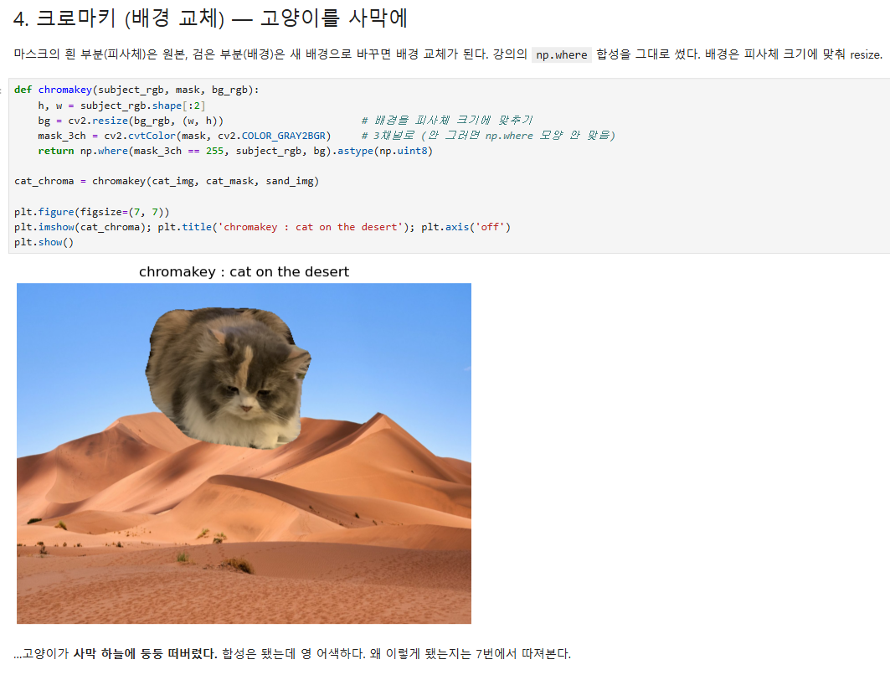
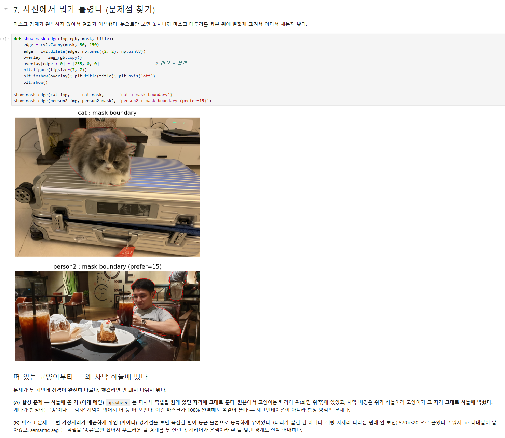
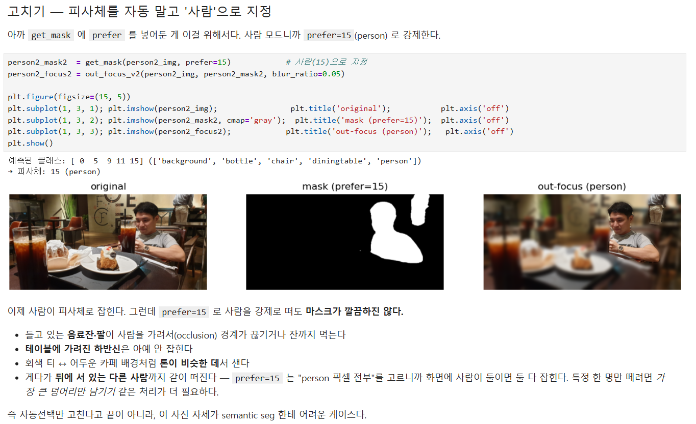
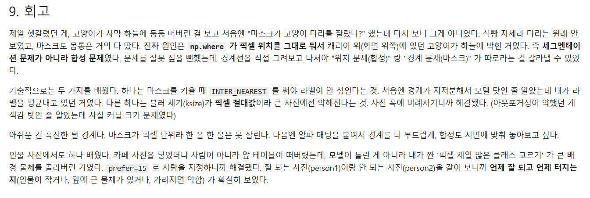
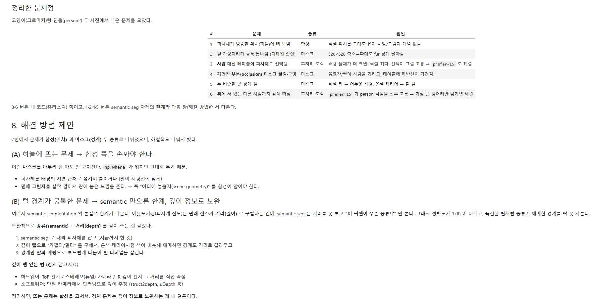
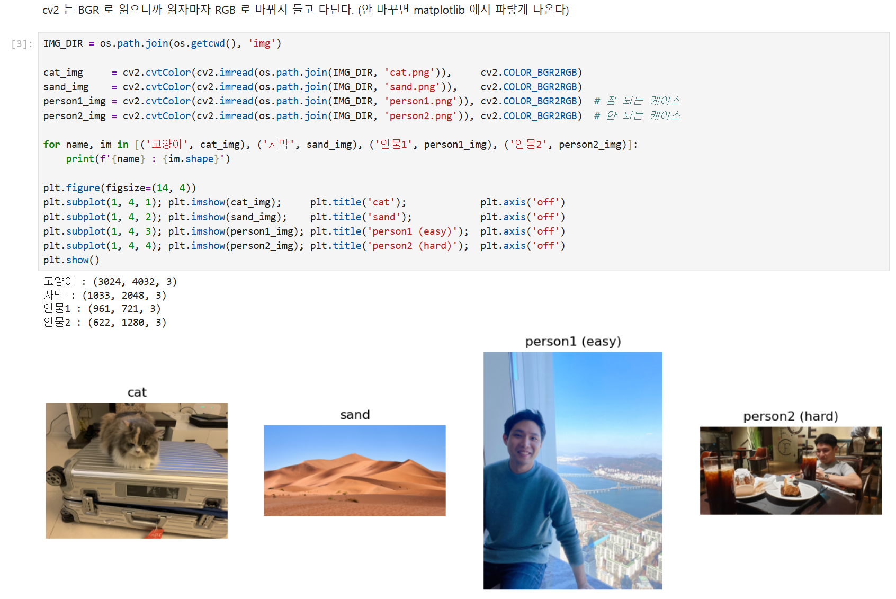

# AIFFEL Campus Online Code Peer Review Templete
- 코더 : 강경수
- 리뷰어 : 김수경

# PRT(Peer Review Template)
- [x]  **1. 주어진 문제를 해결하는 완성된 코드가 제출되었나요?**

사막사진이랑 고양이랑 합성이 된걸 확인할 수 있습니다.  
    
- [x]  **2. 전체 코드에서 가장 핵심적이거나 가장 복잡하고 이해하기 어려운 부분에 작성된 
주석 또는 doc string을 보고 해당 코드가 잘 이해되었나요?**

사진을 자르는 과정에서 범위를 확인하기 위한 코드가 추가되있어서 모델이 범위정하는부분에 대해 이해할 수 있었습니다.  

        
- [x]  **3. 에러가 난 부분을 디버깅하여 문제를 해결한 기록을 남겼거나
새로운 시도 또는 추가 실험을 수행해봤나요?**

mask 과정에서 모델이 학습하는 번호를 변경하며서 추가적인 실험한걸 확인할 수 있었습니다.  
        
- [x]  **4. 회고를 잘 작성했나요?**

코드 작성 과정 수정했던 부분에 대해 잘 기록 되어있습니다.  
전체적인 코드에서 수정과정에 대한 기록도 잘 되어있습니다.
        
- [X]  **5. 코드가 간결하고 효율적인가요?**

주석으로 추가 설명과 이미지가 잘 출력된걸 확인할수있습니다.

# 회고(참고 링크 및 코드 개선)

이번 과제를 수행하면서 노드에서 제공하는 np.where 합성 코드로는 합성하는 사진의 사이즈가 조절되지 않아 배경이랑 고양이랑 사이즈가 동일해 자연스럽지 않은 부분이 아쉽다.
mask 과정에서 다양한 코드로 실습을 하고 문제해결 방안에 대해서도 기록해두어 도움이 되었습니다.