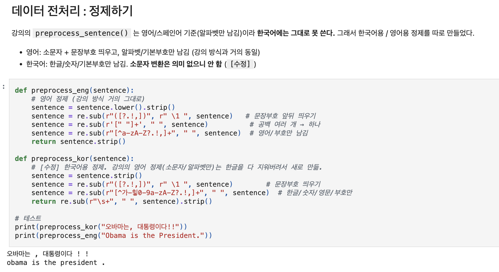
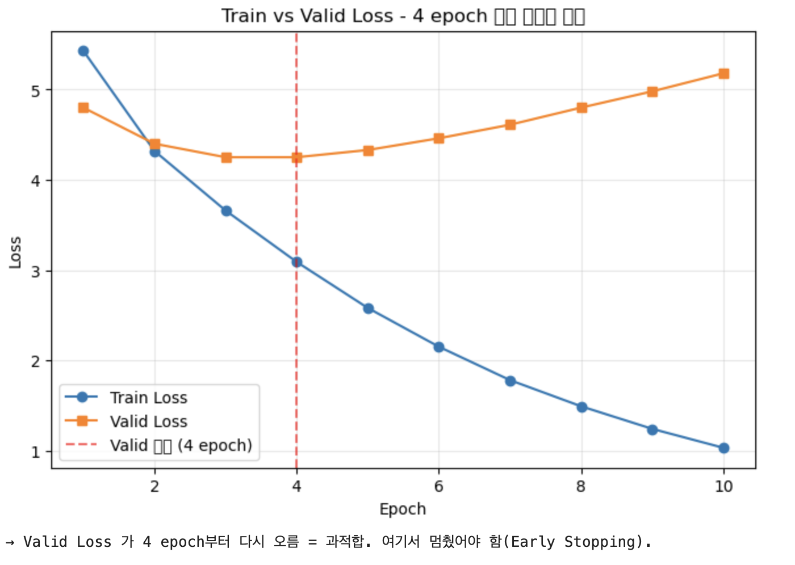
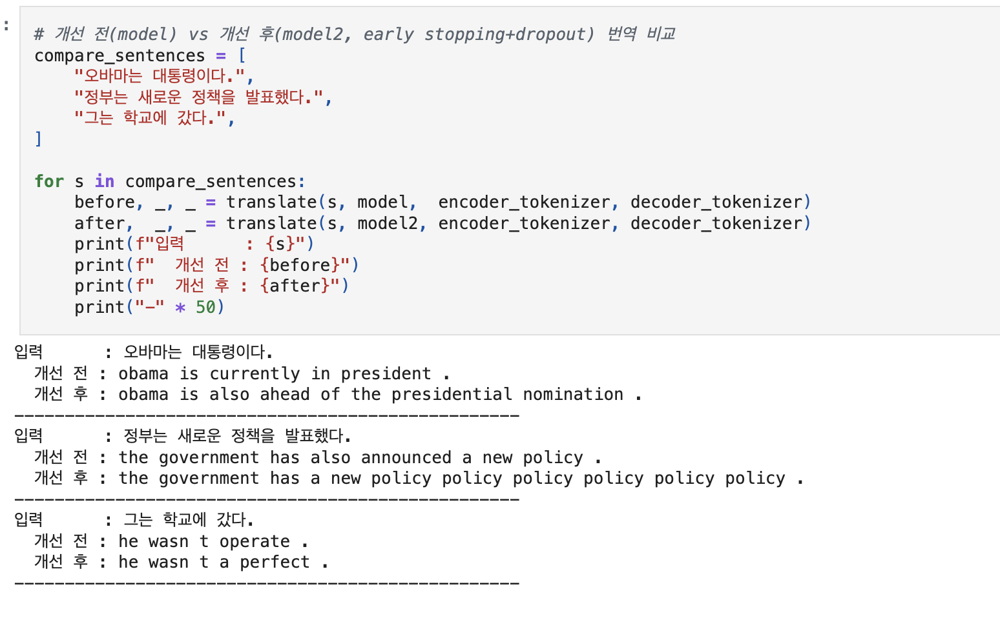
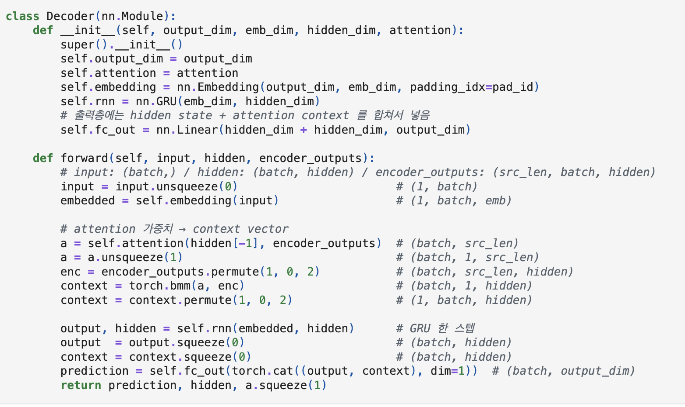
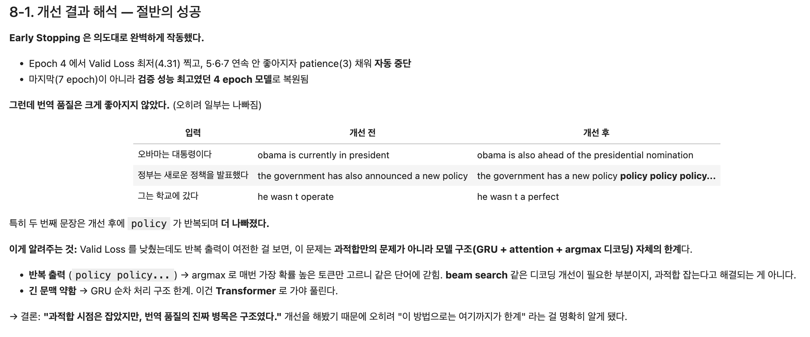
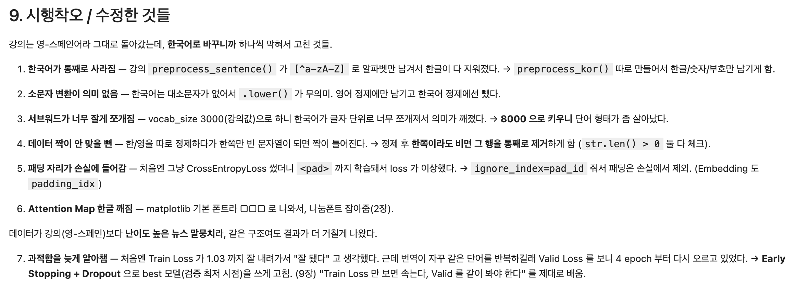
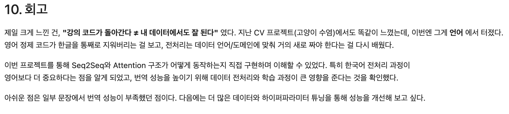
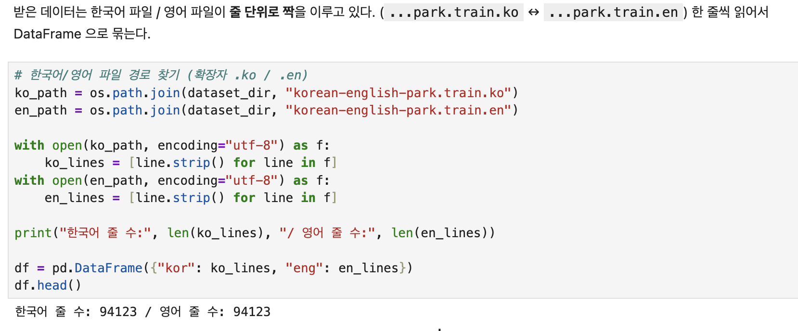

# AIFFEL Campus Online Code Peer Review Templete
- 코더 : 강경수
- 리뷰어 : 이다겸


# PRT(Peer Review Template)
- [x]  **1. 주어진 문제를 해결하는 완성된 코드가 제출되었나요?**

[평가기준]
1. 테스트용 디코더 모델이 정상적으로 만들어져서, 정답과 어느 정도 유사한 영어 번역이 진행됨을 확인하였다.
2. seq2seq 모델 훈련 과정에서 training loss가 안정적으로 떨어지면서 학습이 진행됨이 확인되었다.
3. 구두점, 대소문자, 띄어쓰기, 한글 형태소분석 등 번역기 모델에 요구되는 전처리가 정상적으로 진행되었다.



  

텍스트 전처리를 한글과 영어로 나누어 잘 수행하였다.  
영어 번역의 품질은 향후 개선의 여지가 있다고 생각된다.  
훈련과정에서 training loss의 변화를 확인해서 조기 종료 시점을 설정한 것은 매우 훌륭하다.   
    
- [x]  **2. 전체 코드에서 가장 핵심적이거나 가장 복잡하고 이해하기 어려운 부분에 작성된 
주석 또는 doc string을 보고 해당 코드가 잘 이해되었나요?**

  
 
디코더의 각 행에 차원의 형태를 주석으로 달아놓음으로써 직관적인 확인이 가능하다   
        
- [x]  **3. 에러가 난 부분을 디버깅하여 문제를 해결한 기록을 남겼거나
새로운 시도 또는 추가 실험을 수행해봤나요?**

 
 
        
- [x]  **4. 회고를 잘 작성했나요?**

 
        
- [x]  **5. 코드가 간결하고 효율적인가요?**

 


# 회고(참고 링크 및 코드 개선)
```
문제점을 찾고, 그 문제점을 개선하고자 하는 의지가 매우 훌륭한 퀘스트 수행이라 생각한다. 

다만 한 가지 개선 사항을 추가한다면 다음과 같다.  

퀘스트의 세부 지시 사항을 다시 한 번 읽어보시는 것을 추천합니다. 
퀘스트 세부 지시 사항에서, 전처리시 set 데이터형으로 중복 데이터를 걸러내고, 한글 토큰은 mecab 영어는 split() 메서드를 활용하라고 안내되어 있습니다. 
SentencePiece 라이브러리를 사용한 것 역시 매우 훌륭하지만 선택이지만, 한글을 토큰화 하기 위해서 한글에 적합한 토크나이저를 사용하는 것이 모델의 품질을 향상시키는데 도움이 될 것입니다. 
그리고 모델 토큰화시 단어수는 최소 10,000이상이라고 제시되어 있으며 데이터가 많지 않기때문에 훈련데이터와 검증 데이터를 따로 나누지 않는다고 지시 되어있습니다. 현재 모델에서 단어수가 8000개로 최소 단어수 이하로 모델이 학습되어 있습니다. 이미 좋은 모델을 구축해두셨기에 단어수를 지시 사항에 맞게 수정하여 학습시킨다면 더 좋은 결과를 얻을 수 있을것이라 생각됩니다. 
```
