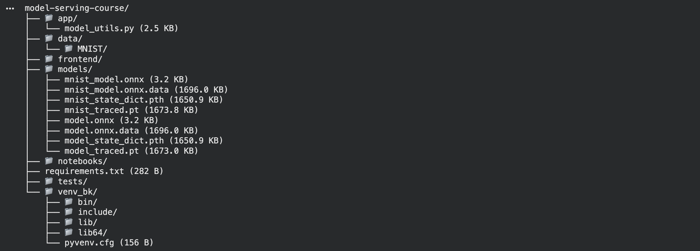

# 모델 배포 개론 01 --- Day 1 제출

## 1. 5.7 수행 내역 캡처

아래 이미지는 노트북의 **5.7 프로젝트 최종 구조 확인** 셀을 실행한
결과입니다.

------------------------------------------------------------------------

## 2. 각 섹션 체크포인트 답변

### 섹션 1. 들어가며: 왜 모델을 배포해야 하는가?

**Q1. `.pth` 파일만 전달했을 때, 상대방이 모델을 바로 사용할 수 없는
이유는 무엇입니까?**

`.pth` 파일에는 모델을 실행하는 데 필요한 모든 환경 정보가 포함되어 있지
않기 때문입니다. 상대방의 Python/PyTorch 버전이나 설치된 라이브러리가
다를 수 있고, `state_dict` 방식이라면 동일한 모델 클래스 정의도
필요합니다. 즉, 모델이 특정 실행 환경에 의존하고 있기 때문에 파일 하나만
전달해서는 바로 사용할 수 없습니다.

**Q2. 모델 학습(Training)과 모델 배포(Serving)의 핵심 차이를 한 문장으로
설명할 수 있습니까?**

모델 학습은 **좋은 모델을 만드는 과정**이고, 모델 배포는 **학습된 모델을
다른 사용자나 서비스가 실제로 사용할 수 있도록 제공하는 과정**입니다.

**Q3. 모델 배포에서 사용자와 서버가 소통하는 방식은 무엇입니까?**

사용자(Client)는 서버에 **HTTP 요청(Request)** 을 보내고, 서버는 요청을
처리한 뒤 **HTTP 응답(Response)** 을 반환하는 방식으로 소통합니다. 모델
서빙에서는 주로 RESTful API 형태로 이 통신을 구현합니다.

------------------------------------------------------------------------

### 섹션 2. 환경 세팅

**Q1. 가상환경 없이 `pip install`을 하면 패키지가 어디에 설치됩니까?
그것이 왜 문제가 될 수 있습니까?**

가상환경 없이 설치하면 시스템 Python의 전역 환경에 패키지가 설치됩니다.
여러 프로젝트가 같은 환경을 공유하면 프로젝트마다 요구하는 패키지 버전이
충돌하거나, 한 프로젝트에서 패키지를 변경했을 때 다른 프로젝트가
동작하지 않는 문제가 발생할 수 있습니다.

**Q2. `pip freeze`로 생성한 파일과 직접 작성한 `requirements.txt`의
차이는 무엇입니까?**

`pip freeze`는 현재 환경에 설치된 **하위 의존성까지 포함한 모든 패키지의
정확한 버전**을 기록하므로 정밀한 환경 재현에 유리합니다. 반면 직접
작성한 `requirements.txt`는 프로젝트에 필요한 **핵심 패키지를 사람이
관리**하기 때문에 더 간결하고 가독성이 좋습니다.

**Q3. 동료에게 프로젝트를 전달할 때, `.venv` 폴더 대신 무엇을 공유해야
합니까?**

`.venv` 폴더 자체가 아니라 **`requirements.txt`와 프로젝트 소스 코드**를
공유해야 합니다. 동료는 자신의 환경에서 새 가상환경을 만든 뒤
`pip install -r requirements.txt`로 필요한 패키지를 설치하여 환경을
재현할 수 있습니다.

------------------------------------------------------------------------

### 섹션 3. RESTful API

**Q1. 모델 추론 요청에 GET이 아닌 POST를 사용하는 이유는 무엇입니까?**

모델 추론은 이미지, 텍스트, 여러 입력값 등 요청 데이터를 서버에 전달해야
하는 경우가 많습니다. POST는 데이터를 **HTTP 요청 본문(body)** 에 담아
전송하기 적합하므로 모델 추론 요청에 사용합니다.

**Q2. 상태 코드 `422`는 어떤 상황에서 발생합니까?**

FastAPI에서 요청 자체는 전달되었지만, 요청 데이터가 서버가 정의한
**Pydantic 스키마의 형식이나 타입 조건을 만족하지 못할 때** 주로
`422 Unprocessable Entity`가 발생합니다.

**Q3. `requests.post(url, json=data)`에서 `json=` 파라미터는 내부적으로
어떤 일을 합니까?**

Python 딕셔너리 등의 데이터를 **JSON 문자열로 직렬화**하고, HTTP 요청
본문에 넣어 전송하며, 일반적으로 `Content-Type: application/json` 헤더도
자동으로 설정합니다.

**Q4. Python의 `True`는 JSON에서 어떻게 표현됩니까?**

JSON에서는 소문자인 **`true`** 로 표현됩니다.

------------------------------------------------------------------------

### 섹션 4. 모델 직렬화

**Q1. `state_dict`로 저장한 `.pth` 파일을 불러올 때, 모델 클래스 정의가
필요한 이유는 무엇입니까?**

`state_dict`에는 모델의 **가중치와 파라미터 값**이 저장되지만 모델의
구조 자체는 저장되지 않습니다. 따라서 먼저 동일한 모델 클래스로 구조를
생성한 뒤, 저장된 `state_dict`를 그 구조에 불러와야 합니다.

**Q2. `torch.jit.trace`와 `torch.jit.script`는 각각 어떤 상황에서
사용합니까?**

`torch.jit.trace`는 예제 입력을 따라 실행 경로를 기록하므로 **입력에
따른 `if/else` 분기가 없는 모델**에 적합합니다. `torch.jit.script`는
제어 흐름까지 분석할 수 있으므로 **입력에 따라 서로 다른 연산 경로를
타는 모델**에 적합합니다.

**Q3. ONNX의 가장 큰 장점은 무엇이며, 어떤 상황에서 선택해야 합니까?**

ONNX의 가장 큰 장점은 **프레임워크와 실행 환경에 대한 독립성**입니다.
PyTorch 모델을 ONNX로 변환하면 ONNX Runtime, TensorRT, OpenVINO 등
다양한 환경에서 실행할 수 있습니다. 따라서 다른 프레임워크와의 호환성이
필요하거나, 추론 성능 최적화가 중요한 프로덕션 환경에서 선택할 수
있습니다.

**Q4. `torch.onnx.export()`에서 `dynamic_axes`를 지정하지 않으면 어떤
문제가 생길 수 있습니까?**

예제 입력에서 사용한 배치 크기가 모델 입력 크기로 **고정될 수
있습니다**. 예를 들어 `batch_size=1`로 내보내면 실제 배포 환경에서 여러
입력을 한 번에 처리하기 어려워질 수 있으므로, 가변 배치 크기가 필요할 때
`dynamic_axes`를 지정해야 합니다.

------------------------------------------------------------------------

### 섹션 5. 실습

**Q1. 모델 저장 전에 `model.eval()`을 호출해야 하는 이유는 무엇입니까?**

Dropout과 BatchNorm 같은 레이어는 학습 모드와 추론 모드에서 동작 방식이
다르기 때문입니다. 추론용 모델을 저장하기 전에 `model.eval()`을 호출하여
**추론 모드로 전환**해야 저장 후에도 일관된 추론 결과를 얻을 수
있습니다.

**Q2. `predict()` 함수를 별도 모듈로 분리한 이유는 무엇입니까?**

모델 로딩, 전처리, 추론 등의 로직을 `predict()` 함수로 분리하면 이후
**FastAPI 엔드포인트에서 쉽게 호출**할 수 있고, API 코드와 추론 로직을
분리하여 재사용성과 유지보수성을 높일 수 있습니다.
