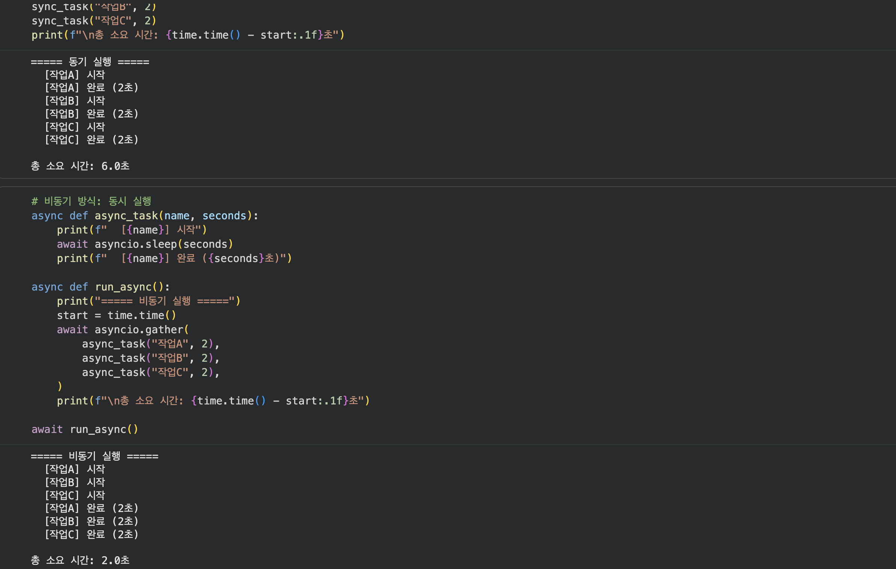
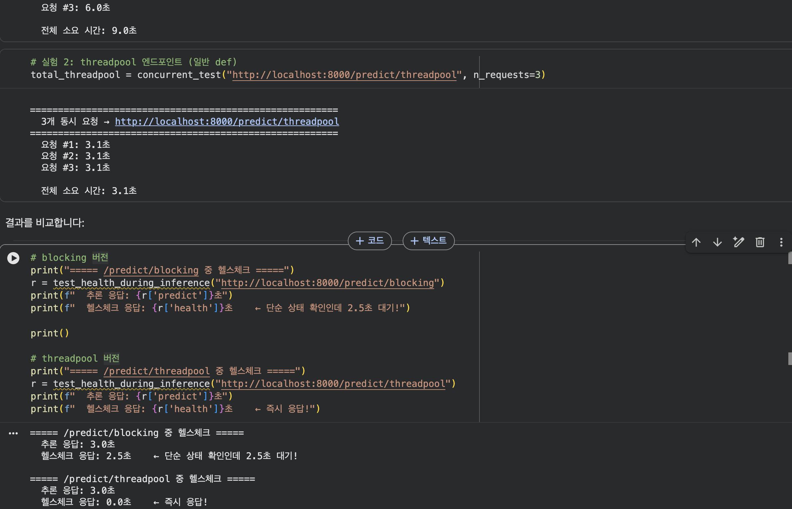
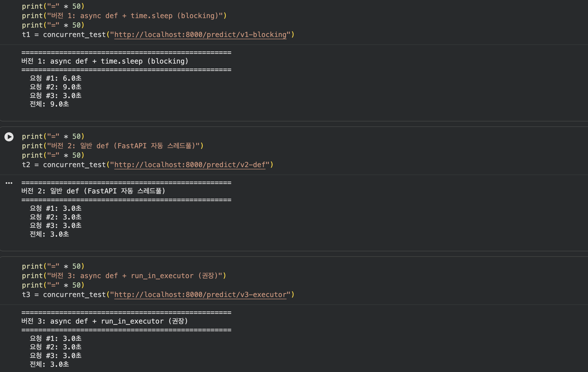
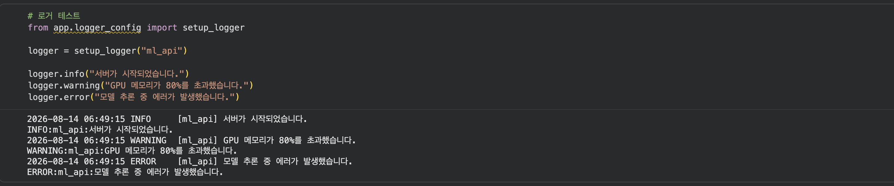
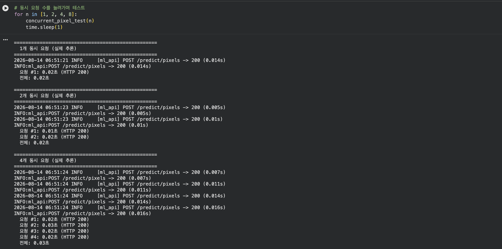
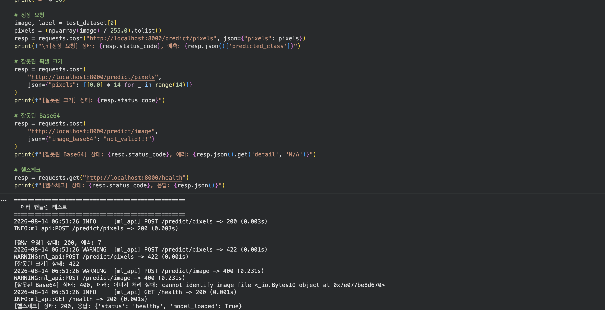

# 모델 배포 개론 — Day 3 제출

**주제:** 비동기 처리와 에러 핸들링 (동시 요청 처리 성능 개선)

> 제출 항목
> 1. 각 섹션 실행 스샷
> 2. 각 섹션 체크포인트 답변

---

## 2. async/await의 기본 원리



### 실습: 동기 vs 비동기 실행 시간 비교

동기 방식 — 세 작업(각 2초)을 순차 실행:

```
===== 동기 실행 =====
  [작업A] 시작
  [작업A] 완료 (2초)
  [작업B] 시작
  [작업B] 완료 (2초)
  [작업C] 시작
  [작업C] 완료 (2초)

총 소요 시간: 6.0초
```

비동기 방식 — `asyncio.gather`로 동시 실행:

```
===== 비동기 실행 =====
  [작업A] 시작
  [작업B] 시작
  [작업C] 시작
  [작업A] 완료 (2초)
  [작업B] 완료 (2초)
  [작업C] 완료 (2초)

총 소요 시간: 2.0초
```

세 작업이 모두 "시작"을 먼저 출력하고 대기에 들어간 뒤 동시에 완료됩니다. 동기 6.0초 → 비동기 2.0초로, 대기 시간이 겹쳐 전체 시간이 단축되었습니다.

### 섹션 2 체크포인트

**1. `time.sleep(3)`과 `await asyncio.sleep(3)`의 핵심 차이는 무엇입니까?**
`time.sleep(3)`은 **동기 블로킹**으로, 현재 스레드 전체를 3초간 정지시킵니다. 그 스레드에서 돌던 이벤트 루프도 멈추므로 다른 코루틴/요청도 진행되지 못합니다. 반면 `await asyncio.sleep(3)`은 **논블로킹**으로, "3초 뒤에 깨워달라"고 이벤트 루프에 등록하고 **제어권을 루프에 반환**합니다. 그 3초 동안 루프는 다른 코루틴을 실행합니다. 즉 대기(wait)를 양보(yield)로 바꾸는 것이 핵심입니다.

**2. 모델 추론처럼 CPU를 계속 사용하는 작업에서 `async/await`만으로 동시 처리가 안 되는 이유는 무엇입니까?**
async/await의 동시성은 **대기(I/O wait) 시간에 다른 일을 하는 것**에서 나옵니다. 그런데 CPU 바운드 추론은 대기가 아니라 계속 연산 중이라 **`await`로 제어권을 양보할 지점이 없습니다.** 게다가 파이썬 GIL 때문에 한 프로세스 안에서 파이썬 바이트코드는 한 번에 한 스레드만 실행되고, 이벤트 루프는 단일 스레드에서 돌기 때문에 CPU를 붙잡은 코루틴이 루프를 독점하여 다른 요청을 막습니다. 그래서 CPU 작업은 별도 스레드풀(`run_in_executor`)이나 별도 프로세스로 분리해야 합니다.

---

## 3. 문제 시연: 동기 추론이 서버를 멈추는 순간



### 실험 1 — blocking 엔드포인트 (`async def` + `time.sleep`)

```
=======================================================
  3개 동시 요청 → http://localhost:8000/predict/blocking
=======================================================
  요청 #1: 3.0초
  요청 #2: 9.0초
  요청 #3: 6.0초

  전체 소요 시간: 9.0초
```

### 실험 2 — threadpool 엔드포인트 (일반 `def`)

```
=======================================================
  3개 동시 요청 → http://localhost:8000/predict/threadpool
=======================================================
  요청 #1: 3.1초
  요청 #2: 3.1초
  요청 #3: 3.1초

  전체 소요 시간: 3.1초
```

blocking은 순차 처리되어 전체 9.0초, threadpool은 병렬 처리되어 전체 3.1초입니다.

### 추론 중 헬스체크 응답 비교

```
===== /predict/blocking 중 헬스체크 =====
  추론 응답: 3.0초
  헬스체크 응답: 2.5초    ← 단순 상태 확인인데 2.5초 대기!

===== /predict/threadpool 중 헬스체크 =====
  추론 응답: 3.0초
  헬스체크 응답: 0.0초    ← 즉시 응답!
```

blocking 버전에서는 헬스체크조차 2.5초 대기하는 반면, threadpool 버전은 즉시 응답합니다.

### 섹션 3 체크포인트

**1. `async def` 안에서 `time.sleep(3)`을 호출하면 왜 다른 요청까지 지연됩니까?**
`async def` 엔드포인트는 **이벤트 루프(단일 스레드)** 위에서 실행됩니다. `time.sleep`은 동기 블로킹이라 그 스레드를 통째로 3초간 붙잡아 이벤트 루프를 멈춥니다. 그러면 큐에 있는 다른 요청(코루틴)이 전부 대기하게 됩니다. 실측에서 3개 동시 blocking 요청이 3·6·9초로 순차 처리되어 전체 9초가 걸린 것이 그 결과입니다.

**2. 일반 `def`로 선언된 엔드포인트는 FastAPI가 내부적으로 어떻게 처리합니까?**
FastAPI(Starlette)는 `def`(비-async) 엔드포인트를 이벤트 루프를 막지 않기 위해 **별도의 스레드풀(anyio worker thread)에서 실행**합니다. 따라서 내부가 동기 블로킹 코드라도 이벤트 루프는 자유로워, 동시 요청이 병렬로 처리되고(실측 3개가 각 3.1초, 전체 3.1초) 헬스체크도 즉시 응답합니다(0.0초).

**3. blocking 추론 중 헬스체크까지 막히면 실무에서 어떤 문제가 발생할 수 있습니까?**
로드밸런서나 쿠버네티스는 `/health`로 인스턴스의 생존(liveness/readiness)을 확인합니다. 추론이 이벤트 루프를 막아 헬스체크가 타임아웃되면, 오케스트레이터가 그 인스턴스를 **죽은 것으로 오판**하여 트래픽에서 제거하거나 파드를 강제 재시작(kill)합니다. 즉 정상 작동 중인 서버가 부하만으로 강제 종료되고, 이것이 연쇄 장애로 번집니다. **추론 부하가 곧 가용성 장애로 이어지는 것**이 핵심 위험입니다.

---

## 4. 해결 패턴: run_in_executor로 블로킹 방지하기



### 세 가지 버전 비교 (3개 동시 요청)

```
==================================================
버전 1: async def + time.sleep (blocking)
==================================================
  요청 #1: 6.0초
  요청 #2: 9.0초
  요청 #3: 3.0초
  전체: 9.0초
```

```
==================================================
버전 2: 일반 def (FastAPI 자동 스레드풀)
==================================================
  요청 #1: 3.0초
  요청 #2: 3.0초
  요청 #3: 3.0초
  전체: 3.0초
```

```
==================================================
버전 3: async def + run_in_executor (권장)
==================================================
  요청 #1: 3.0초
  요청 #2: 3.0초
  요청 #3: 3.0초
  전체: 3.0초
```

버전 1은 전체 9초(순차), 버전 2·3은 전체 3초(병렬)입니다. 버전 2와 3은 결과는 같지만 스레드풀 제어 방식이 다릅니다(체크포인트 3번 참고).

### 스레드풀 크기 가이드

```
CPU 코어 수: 2
권장 max_workers (CPU 추론): 2
권장 max_workers (GPU 추론): 1~2
```

### 섹션 4 체크포인트

**1. `run_in_executor`가 이벤트 루프 블로킹을 방지하는 원리는 무엇입니까?**
동기(블로킹) 함수를 이벤트 루프 스레드에서 직접 실행하지 않고 **별도 스레드풀에 넘겨 실행**합니다. `await loop.run_in_executor(...)`로 결과를 기다리는 동안 이벤트 루프는 제어권을 되찾아 다른 코루틴을 처리합니다. 즉 블로킹 작업을 다른 스레드로 **격리**하여 루프가 멈추지 않게 합니다.

**2. `run_in_executor`의 첫 번째 인자에 `None`을 넣으면 어떤 스레드풀이 사용됩니까?**
이벤트 루프의 **기본 executor(default ThreadPoolExecutor)** 가 사용됩니다. 커스텀 executor를 지정하지 않겠다는 의미입니다. (실무에서는 추론 전용 커스텀 풀을 넘겨 크기를 직접 통제하는 경우가 많습니다.)

**3. 일반 `def`와 `async def + run_in_executor`의 핵심 차이는 무엇입니까?**
둘 다 블로킹을 스레드풀로 위임한다는 결과는 비슷하지만 **제어권**이 다릅니다. 일반 `def`는 FastAPI가 자동으로 기본 스레드풀에 던지므로 풀의 크기나 대상을 제어할 수 없습니다. `async def + run_in_executor`는 **어떤 코드를 어떤 풀(크기를 제한한 커스텀 풀)에서 돌릴지 명시적으로 제어**할 수 있어, GPU처럼 동시 실행 수를 제한해야 하는 작업에 필수적입니다. 실측상 버전 2·3 모두 전체 3초로 동일하지만, 버전 3이 리소스 통제력을 제공합니다.

**4. GPU 추론 시 스레드풀 크기를 1~2로 제한하는 이유는 무엇입니까?**
GPU는 한 번에 소화할 수 있는 연산량과 메모리(VRAM)가 물리적으로 제한됩니다. 스레드를 많이 띄워 동시에 추론을 밀어넣으면 **VRAM OOM**이 발생하거나, GPU가 어차피 작업을 직렬화하면서 컨텍스트 스위칭 오버헤드만 늘어 오히려 느려집니다. CPU 코어 수만큼 늘리는 CPU 추론과 달리, GPU는 1~2로 좁혀 큐잉하는 것이 안정적입니다. (처리량을 올리려면 스레드가 아니라 배치 처리로 접근합니다.)

---

## 5. 에러 핸들링과 로깅



### 로거 테스트

```
2026-08-14 05:44:26 INFO     [ml_api] 서버가 시작되었습니다.
2026-08-14 05:44:26 WARNING  [ml_api] GPU 메모리가 80%를 초과했습니다.
2026-08-14 05:44:26 ERROR    [ml_api] 모델 추론 중 에러가 발생했습니다.
```

레벨(INFO/WARNING/ERROR)이 구분되고, 타임스탬프와 로거 이름(`[ml_api]`)이 일관된 형식으로 붙습니다.

### 섹션 5 체크포인트

**1. 글로벌 Exception Handler를 사용하면 어떤 반복을 줄일 수 있습니까?**
모든 엔드포인트마다 `try/except`를 붙여 동일한 에러 응답(로그 기록 + 사용자용 JSON 반환 + 상태 코드 설정)을 반복 작성하는 것을 없앨 수 있습니다. 처리되지 않은 예외를 **한 곳에서 잡아 일관된 형식으로 응답**하므로, 각 엔드포인트는 핵심 로직에만 집중할 수 있습니다.

**2. 클라이언트에게 스택 트레이스를 노출하면 안 되는 이유는 무엇입니까?**
스택 트레이스에는 파일 경로, 내부 모듈 구조, 라이브러리 버전 등 내부 구현이 드러나 **공격자에게 정보를 제공**하는 보안 위험이 있습니다. 또한 사용자에게는 의미 없는 노이즈이고 전문성이 떨어져 보입니다. 따라서 **로그에는** 상세 트레이스를 기록하고, **클라이언트에는** 일반화된 메시지와 상태 코드만 반환합니다.

**3. `logging` 모듈이 `print()`보다 나은 점은 무엇입니까?**
레벨 구분(DEBUG/INFO/WARNING/ERROR)으로 심각도 관리와 필터링이 가능하고, 타임스탬프·로거 이름·포맷을 일관화할 수 있으며, 출력 대상(콘솔/파일/CloudWatch/Datadog 등)을 핸들러로 전환할 수 있습니다. 모듈별 로거로 출처를 추적하고, 운영 중 레벨만 바꿔 노출량을 조절할 수도 있습니다. `print()`는 stdout에 고정되어 있고 구조·레벨·라우팅이 없습니다.

---

## 6. 실습: 최종 서버 + 동시 요청 테스트



### 의존 파일 준비 및 서버 실행

```
🎉 모든 의존 파일이 준비되었습니다. 다음 셀로 진행하세요.
```

```
2026-08-14 05:48:06 INFO     [ml_api] 모델 로드 중: models/mnist_state_dict.pth
2026-08-14 05:48:06 INFO     [ml_api] 모델 로드 완료
서버 실행됨: http://127.0.0.1:8000
```

### 동시 요청 테스트 (실제 추론, 1·2·4·8개)

```
  1개 동시 요청 (실제 추론) → 전체: 0.06초
  2개 동시 요청 (실제 추론) → 전체: 0.04초
  4개 동시 요청 (실제 추론) → 전체: 0.05초
  8개 동시 요청 (실제 추론) → 전체: 0.09초
```

실제 MNIST 추론은 매우 빠르므로(요청당 약 0.01~0.05초), 8개 동시 요청도 전체 0.09초에 처리됩니다. 미들웨어가 각 요청의 메서드·경로·상태 코드·응답 시간을 자동 로깅합니다(`POST /predict/pixels -> 200 (0.012s)`).

### 에러 핸들링 테스트



```
[정상 요청]      상태: 200, 예측: 7
[잘못된 크기]    상태: 422
[잘못된 Base64]  상태: 400, 에러: 이미지 처리 실패: cannot identify image file ...
[헬스체크]       상태: 200, 응답: {'status': 'healthy', 'model_loaded': True}
```

정상 요청은 200(예측 7), 픽셀 개수가 틀린 요청은 Pydantic 검증으로 422, 잘못된 Base64 이미지는 글로벌 핸들러가 400으로 처리했습니다. **모든 비정상 요청이 서버를 죽이지 않고** 적절한 상태 코드와 메시지를 반환했으며, 미들웨어가 각 요청을 레벨에 맞게 로깅했습니다(정상 INFO, 실패 WARNING).

### Day 3 최종 체크포인트

**Q1. 동기 서버에서 3초 걸리는 추론을 3명이 동시에 요청하면 총 몇 초 걸립니까?**
약 **9초**입니다. 순차 처리되므로 3 + 3 + 3 = 9초입니다. (실측: blocking 3개 동시 요청 전체 9.0초.)

**Q2. `time.sleep(3)`과 `await asyncio.sleep(3)`의 핵심 차이는?**
전자는 스레드와 이벤트 루프를 통째로 멈추는 **동기 블로킹**이고, 후자는 이벤트 루프에 대기를 등록한 뒤 제어권을 양보하는 **논블로킹**입니다. 그 대기 시간 동안 루프는 다른 코루틴을 실행합니다.

**Q3. `async def` 안에서 동기 블로킹 코드를 실행하면 왜 헬스체크까지 영향받습니까?**
단일 스레드 이벤트 루프가 블로킹 코드에 붙잡혀 멈추면, 같은 루프가 처리하는 `/health` 코루틴도 큐에서 대기하게 되기 때문입니다. (실측 헬스체크 2.5초 지연.)

**Q4. `run_in_executor`가 이벤트 루프 블로킹을 방지하는 원리는?**
블로킹 함수를 별도 스레드풀로 넘겨 **격리**하고, `await`로 결과를 기다리는 동안 이벤트 루프는 제어권을 되찾아 다른 코루틴을 처리합니다.

**Q5. 글로벌 Exception Handler를 사용하는 이유는?**
엔드포인트마다 반복되는 에러 처리 코드를 제거하고, 처리되지 않은 예외를 한 곳에서 **일관된 형식으로 응답**하여 서버가 죽지 않도록 하기 위해서입니다.

**Q6. 클라이언트에게 스택 트레이스를 노출하면 안 되는 이유는?**
내부 파일 경로·구조·버전 등 구현 정보가 드러나 **보안 위험**이 되고, 사용자에게는 무의미하기 때문입니다. 로그에는 상세 트레이스를, 응답에는 일반화된 메시지만 담습니다.

---

*Day 3 학습 목표 달성: `async/await`와 `run_in_executor`로 동기 추론이 이벤트 루프를 막는 문제를 해결하여 동시 요청 처리 성능을 개선했고, 글로벌 Exception Handler·로깅·미들웨어로 모든 비정상 요청을 서버 중단 없이 처리하는 안정적인 서버를 완성했습니다.*
