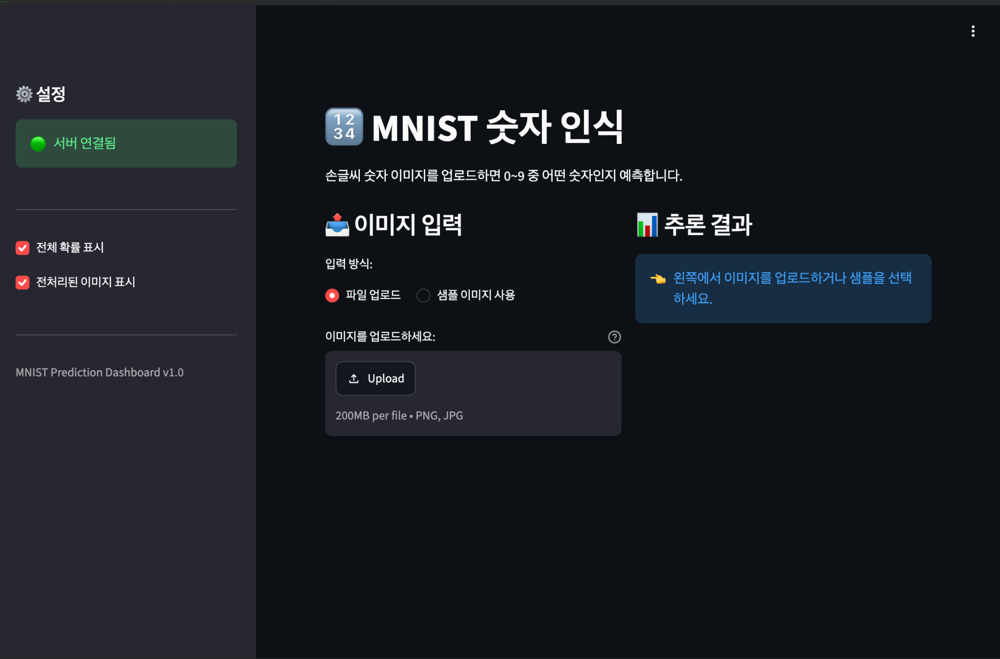
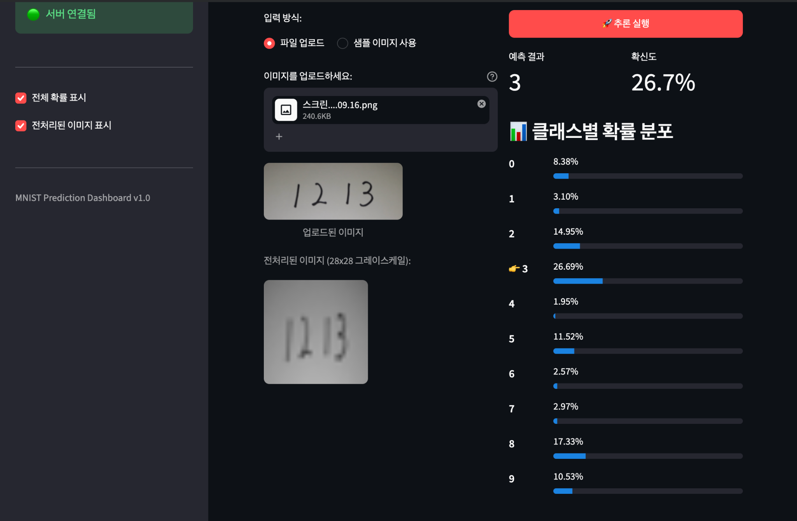
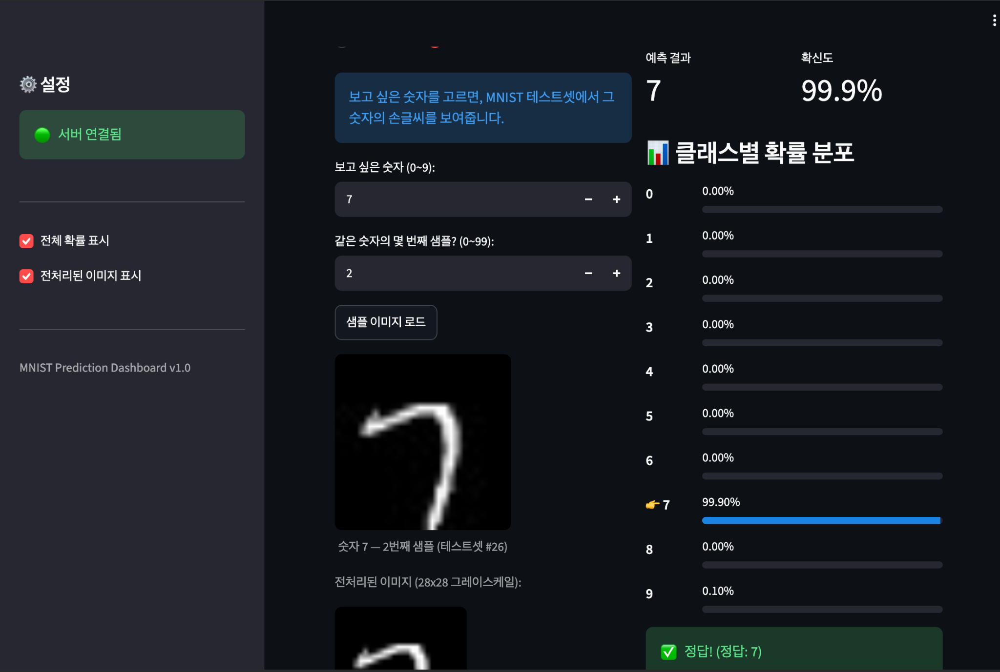

# 모델 배포 개론 - Day 4 제출

**주제:** Streamlit 기반 MNIST 추론 대시보드 구현 및 FastAPI 연동

> 제출 항목 1. 섹션 5 수행 내역 2. 각 섹션 체크포인트 답변

------------------------------------------------------------------------

## 1. 섹션 5 수행 내역 - MNIST 추론 대시보드 구현

### Streamlit 대시보드 및 서버 연결 확인



Streamlit 기반 MNIST 숫자 인식 대시보드를 실행하고 FastAPI 서버가
정상적으로 연결된 것을 확인했습니다.

### 사용자 이미지 업로드 및 추론



직접 작성한 숫자 이미지를 업로드하여 전처리 결과와 모델의 예측 결과,
확신도 및 클래스별 확률 분포가 정상적으로 출력되는 것을 확인했습니다.

### MNIST 샘플 데이터 추론



MNIST 테스트셋의 숫자 7 샘플을 불러와 추론을 실행했습니다. 모델이 숫자
7을 99.9%의 확신도로 예측했으며 실제 정답과 일치하는 것을 확인했습니다.

------------------------------------------------------------------------

## 2. 각 섹션 체크포인트 답변

### 섹션 1 체크포인트 (Streamlit 소개)

**1. Streamlit의 스크립트 재실행 모델이란 무엇입니까?**

Streamlit은 사용자가 버튼을 누르거나 입력값을 변경하는 등 이벤트가
발생할 때마다 Python 스크립트 전체를 위에서 아래로 다시 실행합니다.

**2. `st.text_input()`에 값을 입력하면 내부적으로 어떤 일이
일어납니까?**

사용자가 값을 입력하면 Streamlit 스크립트 전체가 다시 실행되고,
`st.text_input()`이 새로운 입력값을 반환합니다. 이후 코드는 변경된
입력값을 기준으로 다시 렌더링됩니다.

**3. `st.set_page_config()`를 스크립트 중간에 호출하면 어떻게 됩니까?**

`st.set_page_config()`는 페이지 설정을 위한 명령이므로 스크립트 상단에서
먼저 호출해야 합니다. 다른 Streamlit 명령 이후에 호출하면 페이지 설정과
관련된 오류가 발생할 수 있습니다.

------------------------------------------------------------------------

### 섹션 2 체크포인트 (Streamlit 핵심 컨셉)

**1. `st.file_uploader()`로 업로드된 파일의 바이트 데이터는 어떻게
얻습니까?**

`st.file_uploader()`가 반환한 업로드 파일 객체에서 `getvalue()`를
호출하여 바이트 데이터를 얻을 수 있습니다.

``` python
uploaded_file = st.file_uploader("이미지 업로드")
if uploaded_file is not None:
    image_bytes = uploaded_file.getvalue()
```

**2. Streamlit에서 `@st.cache_resource`를 사용하는 이유는 무엇입니까?**

Streamlit은 사용자 이벤트가 발생할 때마다 스크립트 전체를 재실행하므로
객체를 매번 생성하면 비효율적일 수 있습니다. `@st.cache_resource`를
사용하면 API 클라이언트와 같이 재사용 가능한 리소스를 한 번 생성한 뒤
여러 번의 재실행에서도 재사용할 수 있습니다.

------------------------------------------------------------------------

### 섹션 3 체크포인트 (System Architecture)

**1. 모놀리식과 분리 아키텍처의 핵심 차이를 한 문장으로 설명하세요.**

모놀리식 아키텍처는 UI와 모델 추론 등의 기능을 하나의 애플리케이션에서
함께 처리하지만, 분리 아키텍처는 Streamlit 프론트엔드와 FastAPI 백엔드를
독립적인 서비스로 나누어 통신하게 합니다.

**2. 모델을 업데이트할 때, 분리 아키텍처에서는 어떤 서버만 재배포하면
됩니까?**

모델과 추론 로직을 담당하는 FastAPI 백엔드 서버만 재배포하면 됩니다.

**3. Streamlit 앱에 PyTorch가 설치되어 있지 않아도 되는 이유는
무엇입니까?**

모델 로딩과 PyTorch를 이용한 추론은 FastAPI 백엔드가 담당하기
때문입니다. Streamlit은 HTTP 요청을 보내고 응답을 받아 화면에 표시하는
역할을 담당합니다.

------------------------------------------------------------------------

### 섹션 4 체크포인트 (Streamlit에서 FastAPI 호출하기)

**1. 이미지를 API에 전송할 때 Base64로 인코딩하는 이유는 무엇입니까?**

이미지 원본은 바이너리 데이터이므로 그대로 JSON에 넣을 수 없습니다.
따라서 이미지 바이트를 Base64 문자열로 변환하여 JSON 데이터에 포함할 수
있도록 합니다.

**2. `response.raise_for_status()`는 어떤 역할을 합니까?**

HTTP 응답이 4xx 또는 5xx와 같은 오류 상태 코드일 경우 예외를 발생시켜
API 호출 실패를 감지하고 처리할 수 있도록 합니다.

------------------------------------------------------------------------

### Day 4 종합 체크포인트 (섹션 5)

**1. API 호출 실패 시 사용자에게 스택 트레이스가 아닌 메시지를 보여줘야
하는 이유는 무엇입니까?**

스택 트레이스는 일반 사용자가 이해하기 어렵고 내부 구현 정보가 노출될 수
있습니다. 따라서 `st.error()`나 `st.warning()` 등을 이용하여 사용자가
이해할 수 있는 오류 메시지를 제공하는 것이 적절합니다.

**2. `st.session_state`에 결과를 저장하는 이유는 무엇입니까?**

Streamlit은 사용자 입력이나 버튼 클릭 때마다 스크립트를 다시 실행하므로
`st.session_state`를 사용하면 재실행 이후에도 마지막 추론 결과 등의
상태를 유지할 수 있습니다.

**3. 이미지를 API로 전달할 때 Base64 인코딩이 필요한 이유는
무엇입니까?**

이미지는 바이너리 데이터이지만 API 요청에서는 JSON을 사용하므로 이미지
바이트를 Base64 문자열로 변환하여 JSON 필드에 안전하게 담아 전송하기
위해 필요합니다.

------------------------------------------------------------------------

*Day 4 학습 목표 달성: Streamlit 프론트엔드와 FastAPI 백엔드를 연동하여
사용자 이미지 및 MNIST 샘플을 입력받고, 모델 추론 결과와 클래스별 확률을
시각화하는 대시보드를 구현했습니다.*
