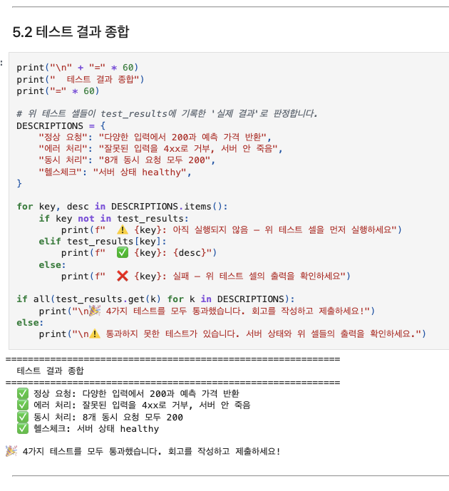
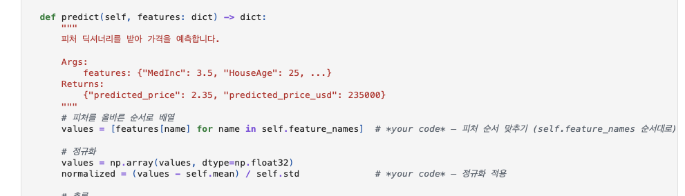
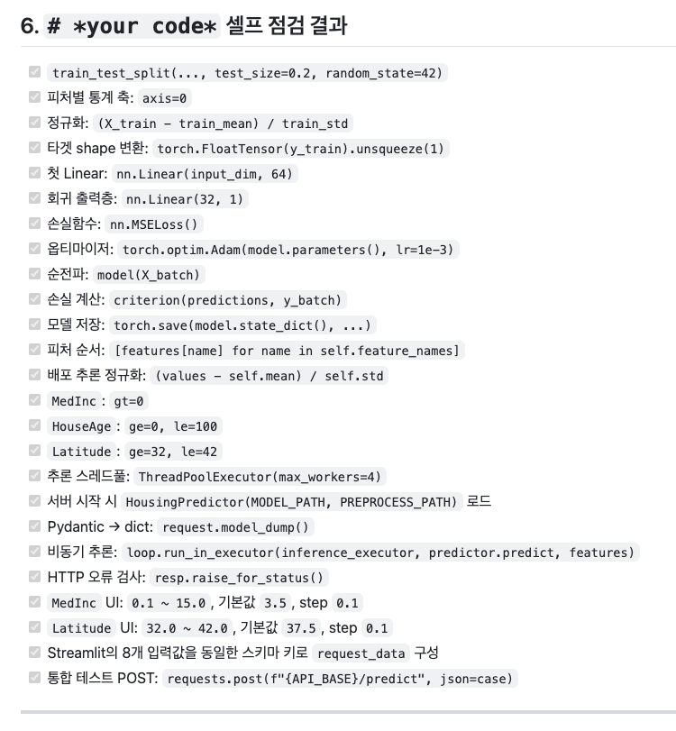
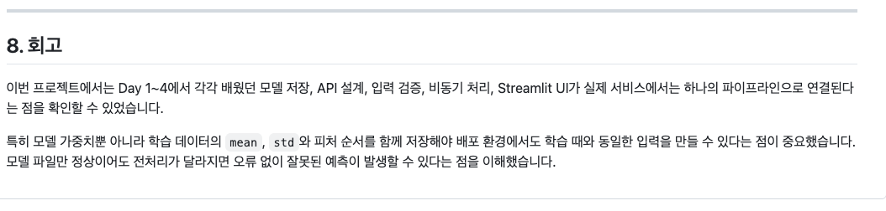
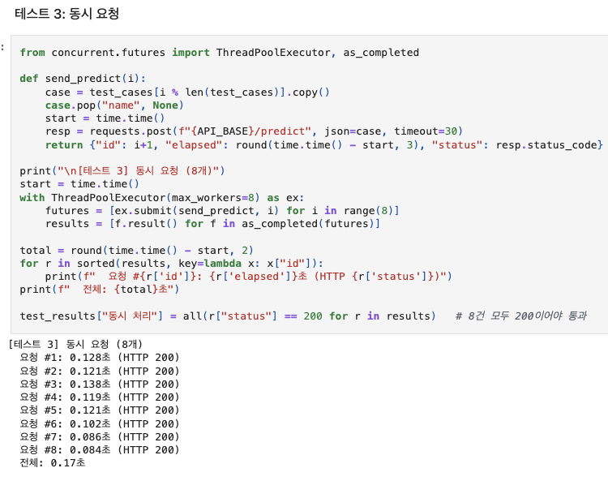

# AIFFEL Campus Online Code Peer Review Templete
- 코더 : 강경수
- 리뷰어 : 김민욱


# PRT(Peer Review Template)
- [x]  **1. 주어진 문제를 해결하는 완성된 코드가 제출되었나요?**
    - 노트북을 위에서 아래로 따라가 봤는데 에러 없이 끝까지 돌아간 상태로 저장되어 있었습니다.  
    - 마지막 통합 테스트에서 네 가지가 다 통과로 찍혀 있어서 한눈에 확인할 수 있었어요.  
    

    - 테스트 MAE 가 38,788 달러로 나왔는데, 저도 비슷하게 나와서 반가웠습니다.  

- [x]  **2. 전체 코드에서 가장 핵심적이거나 가장 복잡하고 이해하기 어려운 부분에 작성된 
주석 또는 doc string을 보고 해당 코드가 잘 이해되었나요?**
    - 저는 `HousingPredictor` 의 `predict()` 가 제일 헷갈렸는데, docstring 에 무엇이 들어가고 무엇이 나오는지 예시값까지 적혀 있어서 읽기 편했습니다.  
    

    - `{"MedInc": 3.5, "HouseAge": 25, ...}` 을 넣으면 `{"predicted_price": 2.35, ...}` 가 나온다고 되어 있어서, 실제로 어떤 모양이 오가는지 바로 그려졌어요.  
    - 그 아래 피처 순서를 맞추는 줄과 정규화하는 줄에도 짧게 한글 주석이 달려 있어서 따라가기 좋았습니다.  

- [x]  **3. 에러가 난 부분을 디버깅하여 문제를 해결한 기록을 남겼거나
새로운 시도 또는 추가 실험을 수행해봤나요?**
    - 이 부분이 제일 인상적이었어요. `Serving_day5.md` 에 빈칸이었던 자리를 하나하나 목록으로 만들어서 전부 확인해 두셨더라고요.  
    

    - 노트북에는 "직접 쓸 수 있는지 스스로 점검해 보세요" 라고만 적혀 있고 넘어가는 부분인데, 저는 그냥 지나갔거든요. 이렇게 목록으로 만들어 두면 나중에 다시 볼 때도 좋을 것 같아서 배웠습니다.  
    - 통합 테스트 결과도 항목별로 따로 정리해두셔서 노트북을 안 열어도 무엇이 확인됐는지 알 수 있었어요.  

- [x]  **4. 회고를 잘 작성했나요?**
    - 노트북과 `Serving_day5.md` 두 군데에 회고를 적어주셨습니다.  
    

    - "모델 파일만 정상이어도 전처리가 달라지면 오류 없이 잘못된 예측이 발생할 수 있다" 는 문장이 기억에 남아요. 저도 오늘 이 부분이 제일 헷갈렸는데 같은 걸 짚으셔서 반가웠습니다.  
    - Day 1~4 에서 따로 배운 것들이 하나로 연결된다는 흐름도 잘 정리되어 있었습니다.  

- [x]  **5. 코드가 간결하고 효율적인가요?**
    - 채워 넣으신 부분들이 군더더기 없이 깔끔했습니다. 한 줄로 끝낼 수 있는 건 한 줄로 쓰셨더라고요.  
    - `app/` 아래를 모델, 스키마, API 세 파일로 나눠두신 것도 좋았어요. 나중에 모델만 바꿀 때 어디를 봐야 할지 바로 알 수 있을 것 같습니다.  
    - 동시 요청 테스트에서 여덟 건이 전부 200 으로 잘 돌아갔습니다.  
    


# 회고(참고 링크 및 코드 개선)
```
[리뷰어 회고]
나도 같은 프로젝트를 했는데, 정리하는 방식이 달라서 배우는 게 많았습니다.

저는 노트북 안에 다 적었는데 강경수님은 체크포인트 답변이랑 셀프 점검을
별도 md 로 빼두셔서, 노트북을 안 열어도 무엇을 했는지 볼 수 있게 하셨더라고요.
이게 읽는 사람 입장에서 훨씬 편한 것 같아서 다음에 저도 이렇게 해보려고 합니다.

특히 your code 셀프 점검 목록이 제일 좋았어요.
저는 그 주석을 보고도 그냥 지나쳤는데, 하나씩 짚어서 확인하신 걸 보고
"이렇게 하면 내가 뭘 알고 뭘 모르는지 확인이 되겠구나" 싶었습니다.

전처리 파라미터를 모델이랑 같이 저장해야 한다는 부분은 저도 오늘 제일 많이 헤맸는데,
회고에 같은 이야기를 적어두신 걸 보고 다들 비슷하게 느끼는구나 했습니다.

고생 많으셨습니다!
```
