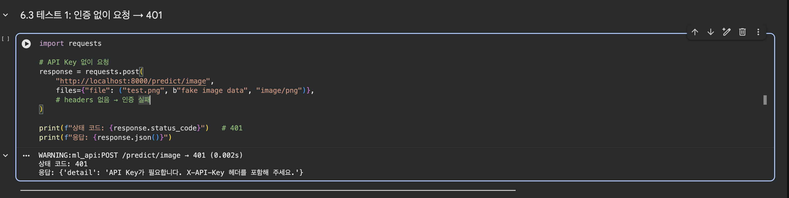
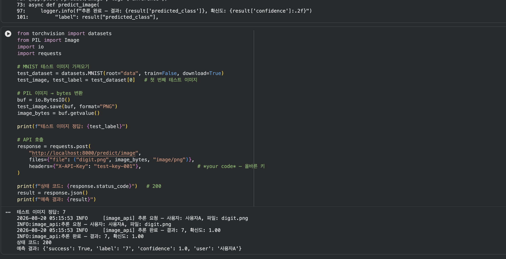
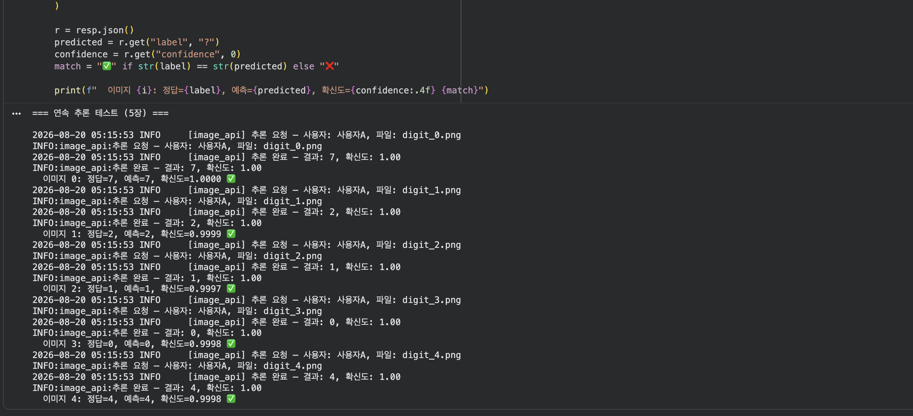
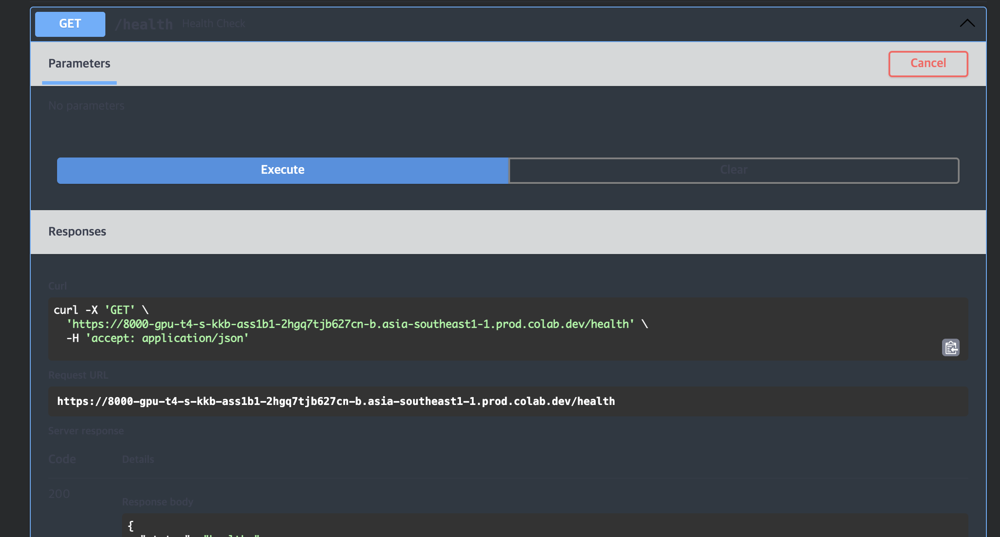
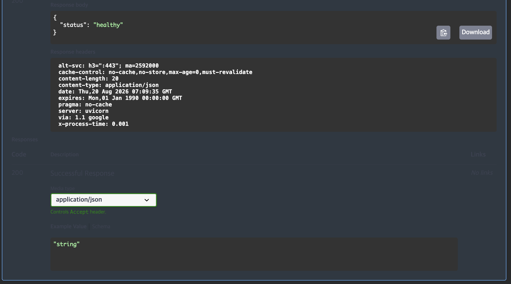
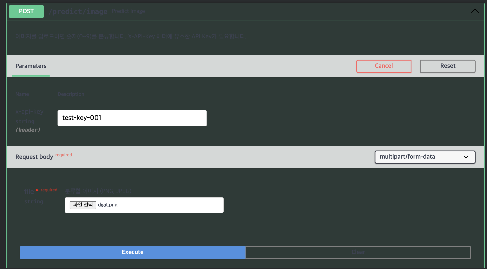
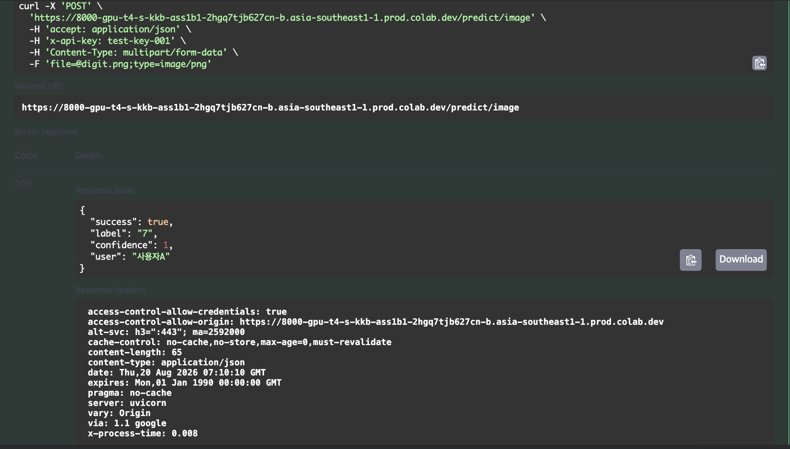

# 모델 배포 개론 - Day 6 제출

**주제:** API Key 인증 및 미디어 처리 기초  
**구성:** API Key 인증 → UploadFile 기반 이미지 업로드 → 파일 검증/전처리 → MNIST 추론 API → Swagger 테스트

> **제출 항목**
> 1. 섹션 6 수행내역 캡처
> 2. 6.8 Swagger UI 수행 화면 포함
> 3. 각 섹션 체크포인트 답변

---

## 1. 섹션 6 수행 내역

### 1.1 API Key 인증 테스트

API Key가 없는 요청과 잘못된 API Key 요청이 모두 `401 Unauthorized`로 처리되는 것을 확인했습니다.

- API Key 없음 → `401`
- 잘못된 API Key → `401`

---

### 1.2 올바른 API Key + MNIST 이미지 추론

올바른 API Key `test-key-001`과 MNIST 이미지를 전송했을 때 정상적으로 `200` 응답과 분류 결과가 반환되는 것을 확인했습니다.

실행 결과:
- 테스트 이미지 정답: `7`
- 예측 결과: `7`
- confidence: `1.0`
- user: `사용자A`

---

### 1.3 잘못된 파일 형식 및 연속 추론 테스트

`text/plain` 파일을 전송했을 때 `400 Bad Request`가 반환되어 파일 형식 검증이 정상적으로 동작하는 것을 확인했습니다.

또한 MNIST 테스트 이미지 5장을 연속 요청하여 모두 정답과 동일하게 분류되는 것을 확인했습니다.

- 이미지 0: `7 → 7` ✅
- 이미지 1: `2 → 2` ✅
- 이미지 2: `1 → 1` ✅
- 이미지 3: `0 → 0` ✅
- 이미지 4: `4 → 4` ✅

---

### 1.4 Swagger UI 테스트

Swagger UI의 `POST /predict/image`에서 `x-api-key`에 `test-key-001`을 입력하고 이미지 파일을 업로드하여 정상적으로 추론 결과가 반환되는 것을 확인했습니다.

---

## 2. 각 섹션 체크포인트 답변

### 2.1 섹션 1 체크포인트

#### 1. 인증 없는 API가 위험한 이유를 두 가지 이상 설명하세요.

첫째, URL만 알면 누구나 반복적으로 추론 요청을 보낼 수 있어 서버 자원과 비용이 불필요하게 소모될 수 있습니다.  
둘째, 사용자를 구분할 수 없기 때문에 누가 얼마나 API를 사용했는지 추적하거나 사용량을 제한하기 어렵습니다.  
또한 악의적인 대량 요청이 들어오면 정상 사용자의 서비스 이용에도 영향을 줄 수 있습니다.

#### 2. API Key 방식이 ML 추론 API에 적합한 이유는 무엇입니까?

사용자 로그인 과정 없이 요청 헤더에 키 하나만 포함하면 인증할 수 있어 구조가 단순합니다.  
또한 키별로 사용자를 구분할 수 있으므로 인증과 사용량 추적을 함께 처리하기 좋습니다.

---

### 2.2 섹션 2 체크포인트

#### 1. `Header(None)`에서 `None`은 어떤 상황에서 `x_api_key`에 들어갑니까?

클라이언트 요청에 `X-API-Key` 헤더가 포함되지 않았을 때 `x_api_key`에 `None`이 들어갑니다.

#### 2. `Depends(verify_api_key)`를 엔드포인트에 추가하면 요청 처리 흐름이 어떻게 바뀝니까?

엔드포인트의 본문이 실행되기 전에 `verify_api_key()`가 먼저 실행됩니다.  
API Key가 정상이라면 인증된 사용자 이름을 반환하고 엔드포인트가 계속 실행되며, 키가 없거나 잘못되었다면 `401` 에러를 반환하고 엔드포인트 본문은 실행되지 않습니다.

#### 3. 인증 실패 시 반환하는 HTTP 상태 코드 401의 의미는 무엇입니까?

`401 Unauthorized`는 요청에 필요한 인증 정보가 없거나 인증 정보가 유효하지 않아 요청을 처리할 수 없다는 의미입니다.

---

### 2.3 섹션 4 체크포인트

#### 1. `UploadFile`과 Base64 방식의 핵심 차이는 무엇입니까?

Base64 방식은 파일을 문자열로 인코딩하여 JSON 안에 포함하는 방식이고, `UploadFile`은 파일 자체를 `multipart/form-data` 형식으로 전송하는 방식입니다.

파일을 독립적으로 업로드하는 경우에는 `UploadFile`이 더 직접적이며, Swagger UI에서도 파일 선택 버튼을 사용할 수 있어 테스트가 편리합니다.

#### 2. `file.content_type`으로 타입을 검증하는 이유는 무엇입니까?

서버가 허용한 PNG 또는 JPEG 같은 형식인지 1차적으로 확인하여 `text/plain`처럼 명백히 잘못된 파일을 빠르게 차단하기 위해서입니다.

다만 `content_type`은 클라이언트가 전달하는 값이므로 위조될 수 있기 때문에 실제 이미지 여부는 PIL 디코딩 단계에서도 다시 확인해야 합니다.

#### 3. 파일 크기를 제한하지 않으면 어떤 문제가 발생할 수 있습니까?

매우 큰 파일을 반복해서 업로드하면 서버의 메모리, 디스크, 네트워크 대역폭 등의 자원을 과도하게 사용할 수 있습니다.  
따라서 일정 크기 이상을 거부하여 서버 자원 고갈과 서비스 장애 위험을 줄여야 합니다.

---

## 3. Day 6 최종 체크포인트

### Q1. API Key 인증이 없으면 어떤 위험이 있습니까? (두 가지 이상)

누구나 API를 호출할 수 있어 무단 사용과 과도한 요청으로 비용 및 서버 자원이 낭비될 수 있습니다.  
또한 사용자를 식별할 수 없어 사용자별 사용량 추적이나 접근 제어가 어렵습니다.

### Q2. `Depends(verify_api_key)`는 엔드포인트 실행 전에 어떤 일을 합니까?

요청의 `X-API-Key` 헤더를 확인하고 등록된 API Key인지 검증합니다.  
검증에 성공하면 사용자 정보를 엔드포인트에 전달하고, 실패하면 `401`을 반환하여 실제 추론 로직의 실행을 차단합니다.

### Q3. `UploadFile` 방식이 Base64보다 편리한 점은 무엇입니까?

파일을 별도의 인코딩 과정 없이 직접 업로드할 수 있으며, FastAPI와 Swagger UI에서 파일 업로드 기능을 바로 사용할 수 있습니다.  
Base64처럼 파일을 문자열로 변환해 JSON에 넣는 과정이 필요하지 않습니다.

### Q4. 파일 업로드 시 크기 제한을 하지 않으면 어떤 문제가 생깁니까?

지나치게 큰 파일이 서버에 전송되어 메모리, 디스크, 네트워크 등의 자원을 소모할 수 있고, 반복 요청 시 서비스 장애로 이어질 수 있습니다.

### Q5. 이미지를 28x28 그레이스케일로 변환하는 이유는 무엇입니까?

사용한 MNIST 모델이 `28×28` 크기의 1채널 그레이스케일 이미지를 입력으로 학습했기 때문입니다.  
추론 시에도 학습 때와 동일한 입력 형태를 만들어야 모델이 정상적으로 예측할 수 있습니다.

---

## 4. 수행 결과 정리

- [x] API Key 인증 구현
- [x] 인증 없는 요청 `401` 확인
- [x] 잘못된 API Key 요청 `401` 확인
- [x] 올바른 API Key + 이미지 요청 `200` 확인
- [x] `UploadFile` 기반 이미지 업로드 구현
- [x] PNG/JPEG 형식 검증 구현
- [x] 5MB 파일 크기 제한 구현
- [x] 이미지 디코딩 검증 구현
- [x] 28×28 그레이스케일 변환 적용
- [x] 잘못된 파일 형식 `400` 확인
- [x] MNIST 이미지 5장 연속 추론 성공
- [x] Swagger UI에서 `POST /predict/image` 테스트
