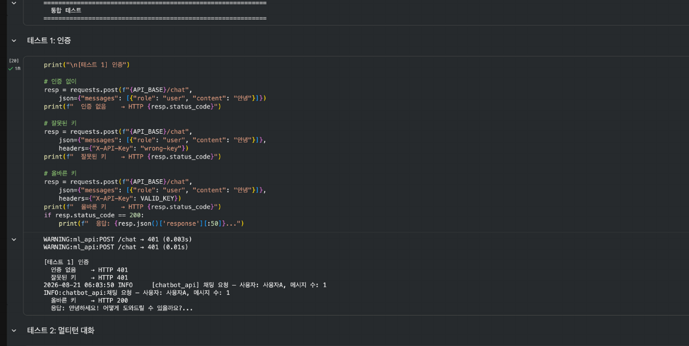
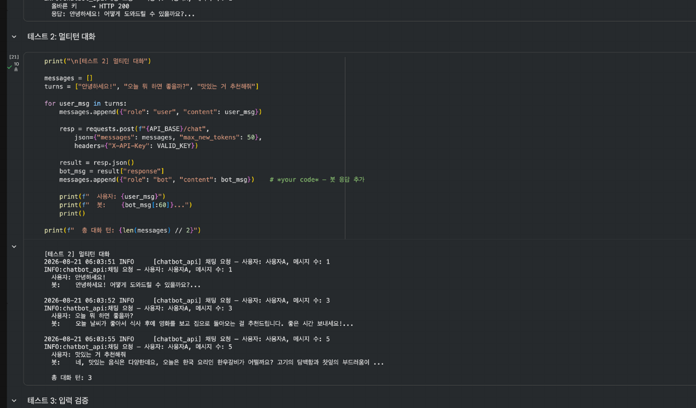
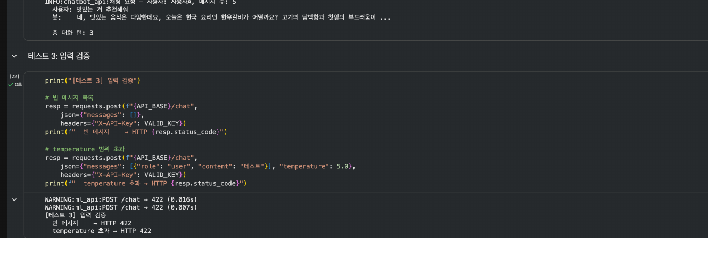
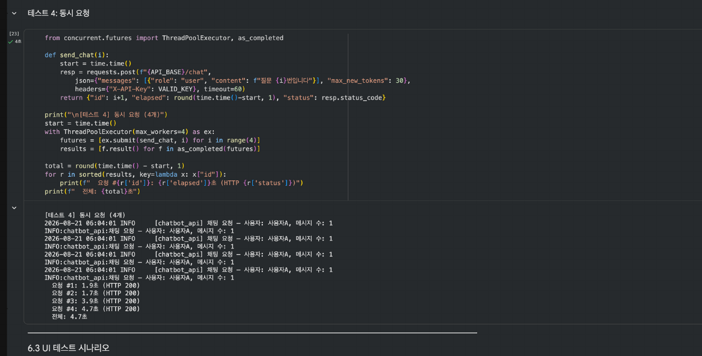
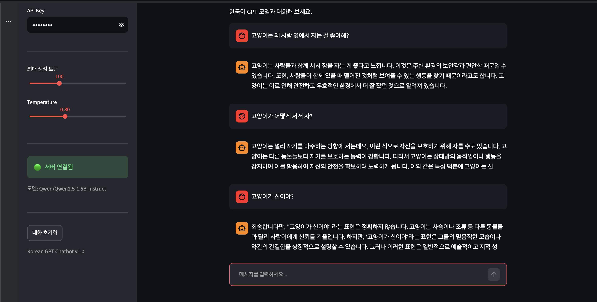
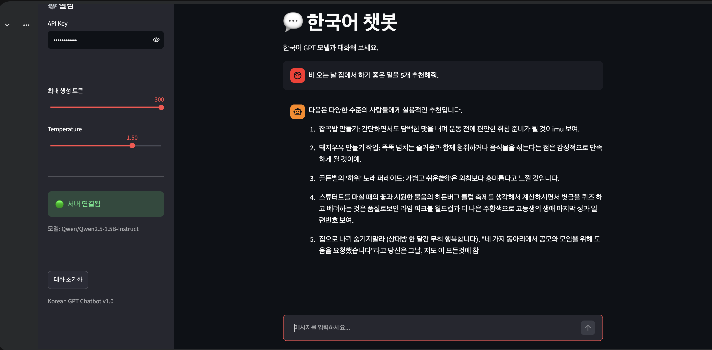
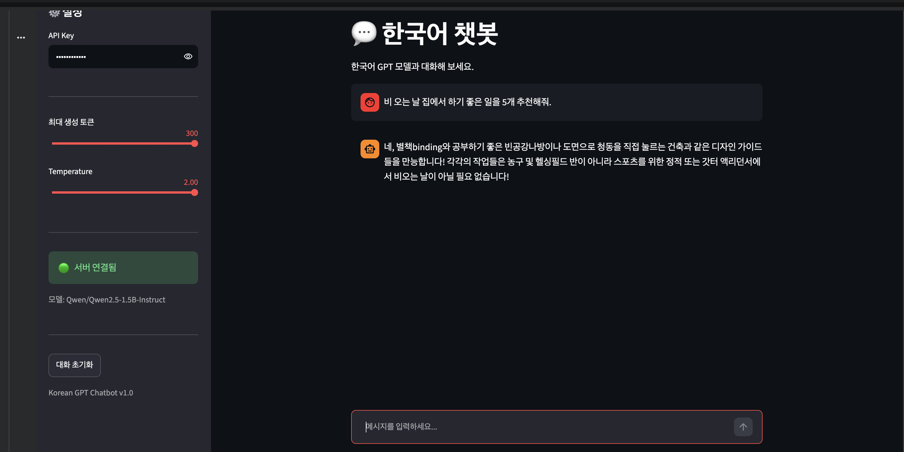
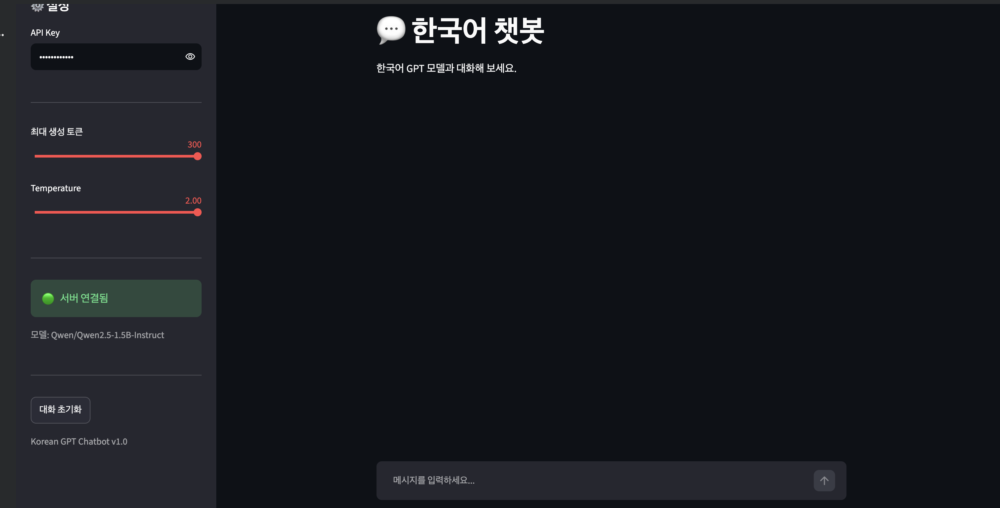
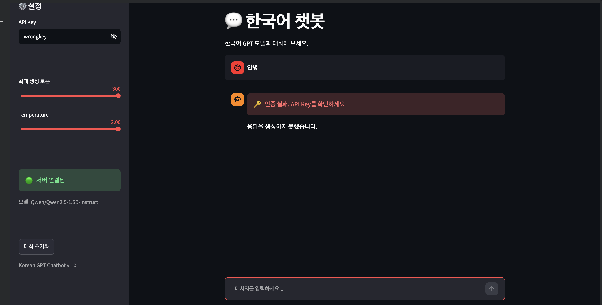

# 모델 배포 개론 - Day 7 제출

**주제:** Hugging Face 기반 한국어 GPT 멀티턴 챗봇 서비스  
**구성:** Transformer 모델 로드 → FastAPI 챗봇 API → API Key 인증 → Streamlit 채팅 UI → 통합 테스트

---

## 1. 프로젝트 실행 내역

### 1.1 테스트 1 - API Key 인증

인증 없이 요청한 경우와 잘못된 API Key를 사용한 경우 모두 `401`이 반환되었고, 올바른 API Key를 사용한 경우 `200`과 정상 챗봇 응답이 반환되는 것을 확인했습니다.

---

### 1.2 테스트 2 - 멀티턴 대화

사용자와 봇의 이전 대화 내용을 `messages` 리스트에 계속 누적하여 전송했고, 총 3턴의 대화가 문맥을 유지하며 정상적으로 처리되는 것을 확인했습니다.

---

### 1.3 테스트 3 - 입력 검증

빈 메시지 목록과 허용 범위를 벗어난 `temperature=5.0` 요청이 모두 `422`로 차단되는 것을 확인했습니다.

---

### 1.4 테스트 4 - 동시 요청

4개의 요청을 `ThreadPoolExecutor`로 동시에 전송했고, 네 요청이 모두 `HTTP 200`으로 처리되는 것을 확인했습니다.

---

## 2. UI 테스트

### 2.1 UI 테스트 A - 기본 대화

Streamlit 채팅 화면에서 사용자 메시지를 입력하고 챗봇 응답이 화면에 표시되는 것을 확인했습니다.

### 2.2 UI 테스트 B - 설정 변경

사이드바에서 최대 생성 토큰과 `Temperature` 값을 조정할 수 있도록 UI가 구성되어 있습니다.

### 2.3 UI 테스트 C - 대화 초기화

사이드바의 `대화 초기화` 버튼을 통해 `session_state`에 저장된 대화 기록을 초기화할 수 있도록 구현했습니다.

### 2.4 UI 테스트 D - API Key 인증

사이드바에서 API Key를 입력하도록 구성했으며, 잘못된 키를 사용하면 `call_chat_api()`에서 `401` 응답을 처리하도록 구현했습니다.

> PDF 실행 캡처에는 UI 테스트 B~D의 **조작 후 결과 화면이 별도로 저장되어 있지 않아**, 해당 기능이 구현된 UI 영역을 추출해 첨부했습니다.

---

## 3. 각 섹션 체크포인트 답변

### 섹션 1 체크포인트

#### 1. Day 5(정형 데이터)와 Day 7(텍스트 생성)에서 전처리가 어떻게 다릅니까?

Day 5에서는 8개의 숫자형 피처를 학습 데이터의 평균과 표준편차로 정규화한 뒤 모델에 입력했습니다.  
Day 7에서는 자연어 문자열을 토크나이저가 토큰 ID 시퀀스로 변환하고, 멀티턴 대화는 모델의 채팅 템플릿 형식에 맞춰 하나의 입력 시퀀스로 구성합니다.

#### 2. Hugging Face Transformers 라이브러리의 역할은 무엇입니까?

사전학습된 Transformer 모델과 토크나이저를 쉽게 불러오고 사용할 수 있도록 `AutoTokenizer`, `AutoModelForCausalLM` 등의 인터페이스를 제공합니다.  
이를 통해 직접 모델 구조를 처음부터 구현하지 않고도 토큰화, 모델 로드, 텍스트 생성 기능을 사용할 수 있습니다.

---

### 섹션 2 체크포인트

#### 1. 토크나이저의 `encode()`와 `decode()`는 각각 어떤 변환을 수행합니까?

`encode()`는 문자열을 모델이 처리할 수 있는 토큰 ID 배열로 변환하고, `decode()`는 모델이 생성한 토큰 ID 배열을 다시 사람이 읽을 수 있는 문자열로 변환합니다.

#### 2. `model.generate()`의 `temperature` 파라미터는 생성 결과에 어떤 영향을 줍니까?

`temperature`가 낮아지면 확률이 높은 토큰을 더 안정적으로 선택하여 결과가 보수적이고 일관되게 생성됩니다.  
반대로 값이 높아지면 다양한 토큰이 선택될 가능성이 커져 응답이 더 다양해질 수 있습니다.

#### 3. 멀티턴 대화에서 이전 대화 기록을 프롬프트에 포함하는 이유는 무엇입니까?

현재 질문만 보내면 모델은 이전 대화 내용을 알 수 없습니다.  
이전 사용자 메시지와 봇 응답을 함께 전달해야 앞선 문맥을 참고해 자연스럽게 다음 응답을 생성할 수 있습니다.

---

### 섹션 3 체크포인트

#### 1. `ChatRequest`의 `messages`가 리스트인 이유는 무엇입니까?

멀티턴 대화에서는 현재 메시지 하나뿐 아니라 이전 사용자 메시지와 봇 응답까지 순서대로 전달해야 하기 때문입니다.  
각 메시지의 `role`과 `content`를 리스트 형태로 전달하면 전체 대화 흐름을 표현할 수 있습니다.

#### 2. 서버가 대화 기록을 저장하지 않고 클라이언트가 매번 전체 기록을 보내는 이유는 무엇입니까?

REST의 무상태 원칙을 유지하기 위해서입니다.  
서버가 사용자별 대화 상태를 저장하지 않으면 각 요청을 독립적으로 처리할 수 있고, 클라이언트가 필요한 대화 기록을 매 요청마다 전달합니다.

#### 3. `max_new_tokens`를 너무 크게 설정하면 어떤 문제가 발생할 수 있습니까?

응답 생성 시간이 길어지고 CPU/GPU 메모리 사용량이 증가할 수 있습니다.  
또한 입력 대화와 생성 토큰의 합이 모델의 최대 컨텍스트 길이를 초과할 수 있기 때문에 적절한 상한을 두어야 합니다.

---

### 섹션 4 체크포인트

#### 1. `st.chat_message`와 `st.chat_input`은 각각 어떤 역할을 합니까?

`st.chat_message`는 사용자와 챗봇의 메시지를 채팅 형태로 화면에 표시하고, `st.chat_input`은 사용자가 새로운 메시지를 입력하는 입력창을 제공합니다.

#### 2. `st.session_state["chat_messages"]`에 대화 기록을 저장하는 이유는 무엇입니까?

Streamlit은 사용자 입력이 발생할 때마다 스크립트를 다시 실행하기 때문에 일반 변수만 사용하면 이전 대화 기록이 사라집니다.  
`session_state`에 저장하면 rerun 이후에도 같은 세션의 대화 내용을 유지할 수 있습니다.

#### 3. `대화 초기화` 버튼이 `st.rerun()`을 호출하는 이유는 무엇입니까?

대화 기록을 빈 리스트로 만든 뒤 즉시 화면을 다시 렌더링해, 기존 채팅 메시지가 사라진 초기 상태를 사용자에게 바로 보여주기 위해서입니다.

---

### 섹션 5 체크포인트

#### 1. 챗봇 API에서 인증이 실패하면 서버는 어떤 상태 코드를 반환합니까?

API Key가 없거나 유효하지 않으면 `401 Unauthorized`를 반환합니다.

#### 2. UI의 `call_chat_api()`는 401 응답을 받으면 사용자에게 무엇을 보여줍니까?

`🔑 인증 실패. API Key를 확인하세요.`라는 오류 메시지를 Streamlit 화면에 표시합니다.

#### 3. Day 6의 인증 모듈 `app/auth.py`를 Day 7에서 수정 없이 재사용할 수 있는 이유는 무엇입니까?

인증 로직은 이미지나 텍스트 같은 입력 데이터 종류와 독립적입니다.  
`X-API-Key` 헤더에서 키를 읽고 등록된 키인지 검증하는 역할만 수행하므로, Day 7의 텍스트 챗봇 API에서도 동일한 모듈을 그대로 사용할 수 있습니다.

---

## 4. Day 7 최종 체크포인트

### Q1. Day 5(정형 데이터)와 Day 7(텍스트 생성)에서 전처리 방식의 차이는?

Day 5는 숫자형 피처를 `mean`, `std`로 정규화하는 방식이고, Day 7은 자연어를 토큰화하여 토큰 ID 시퀀스로 변환하고 채팅 템플릿으로 문맥을 구성하는 방식입니다.

### Q2. 멀티턴 대화에서 서버가 상태를 유지하지 않는 이유는?

REST의 무상태 원칙을 유지하기 위해서입니다. 클라이언트가 매 요청마다 전체 대화 기록을 전달하므로 서버가 사용자별 대화 상태를 별도로 저장할 필요가 없습니다.

### Q3. API Key가 잘못되면 서버는 어떤 상태 코드를 반환하고, UI는 어떻게 처리합니까?

서버는 `401 Unauthorized`를 반환합니다.  
Streamlit UI는 이를 감지하여 `인증 실패. API Key를 확인하세요.`라는 메시지를 사용자에게 표시합니다.

### Q4. temperature를 낮추면 생성 결과에 어떤 변화가 있습니까?

확률이 높은 토큰을 선택하는 경향이 강해져 답변이 더 안정적이고 보수적으로 생성됩니다. 같은 입력에 대한 응답의 다양성도 줄어듭니다.

### Q5. 이 서비스를 다른 컴퓨터에서 실행하려면 무엇이 필요합니까?

프로젝트 코드와 Python 실행 환경, `torch`, `transformers`, `fastapi`, `uvicorn`, `streamlit`, `requests` 등의 필요한 패키지가 있어야 합니다.  
또한 Hugging Face 모델을 다운로드할 수 있는 환경 또는 이미 캐시된 모델이 필요하며, FastAPI와 Streamlit 서버를 각각 실행해야 합니다.

---

## 5. `# *your code*` 셀프 점검 결과

- [x] `AutoTokenizer.from_pretrained(MODEL_NAME)`로 토크나이저 로드
- [x] `AutoModelForCausalLM.from_pretrained(...)`로 인스트럭션 모델 로드
- [x] `model.generate(..., max_new_tokens=50)`로 최대 생성 토큰 수 지정
- [x] 멀티턴 대화 기록을 `"\n".join(conversation) + "\n봇:"`으로 결합
- [x] `tokenizer.apply_chat_template(..., add_generation_prompt=True)`로 채팅 프롬프트 구성
- [x] `generate()`에 `max_new_tokens` 등 생성 파라미터 전달
- [x] Pydantic 스키마에서 `max_new_tokens=100`, `ge=10`, `le=500` 범위 제한
- [x] `Header(None)`으로 `X-API-Key` 헤더 추출
- [x] 인증 실패 시 `401 Unauthorized` 반환
- [x] 서버 시작 시 `ChatbotModel(model_name)` 인스턴스 1회 생성
- [x] `/chat` 엔드포인트에 `Depends(verify_api_key)` 인증 적용
- [x] `run_in_executor()`를 사용해 모델 추론을 별도 스레드에서 실행
- [x] 멀티턴 테스트에서 새로운 사용자 메시지를 대화 기록에 추가
- [x] Streamlit API 요청에 `X-API-Key` 헤더 포함
- [x] `st.session_state["chat_messages"] = []`로 대화 초기화
- [x] `st.chat_message()`로 사용자/봇 메시지 표시
- [x] `st.chat_input()`으로 사용자 입력 수집
- [x] API 응답을 `messages.append({"role": "bot", ...})`로 대화 기록에 추가

---

## 6. 프로젝트 회고

Day 1~6에서 배운 모델 로드, FastAPI, 인증, 비동기 처리, Streamlit UI를 하나의 멀티턴 챗봇 서비스로 연결하면서 각 기능이 실제 배포 흐름에서 어떻게 이어지는지 이해할 수 있었습니다.  
특히 대화 기록을 클라이언트가 관리하는 무상태 구조와 Transformer의 토큰 기반 입력 방식이 기존 정형 데이터 서비스와 크게 다르다는 점을 확인할 수 있었습니다.
